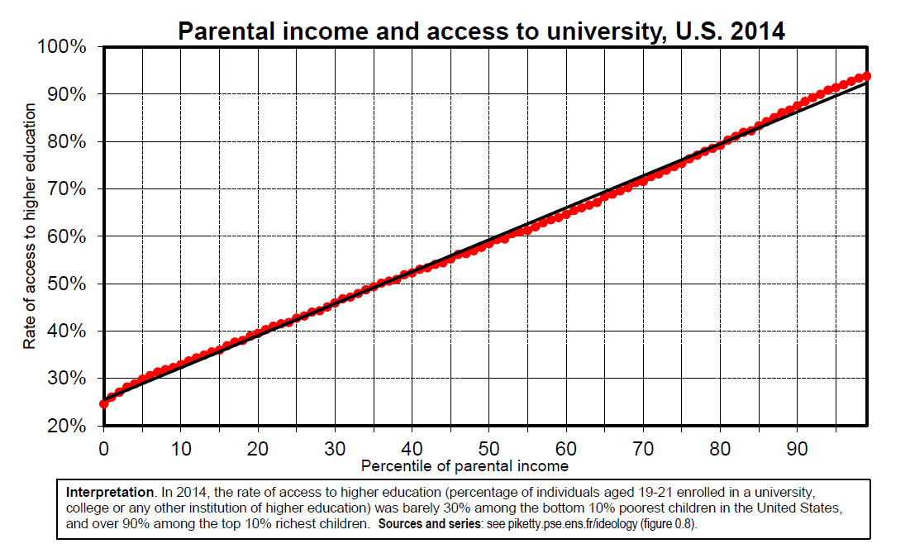

```{r setup, include=FALSE}
knitr::opts_chunk$set(echo = TRUE)
```


# Introduction to Economic History: Capital, Inequality, Growth

## Lecture 1: Development, state formation & inequality in the long run: from ternary to proprietarian societies

### Introduction: development as a quest for justice

* Social and economic progress is a long-term reality (education, health, income, population, etc.); but it is a very fragile process

* Development requires state formation, a stable legal system and a relatively egalitarian educational system; more generally, **development requires acceptable levels of inequality and social justice and a minimal social consensus about the basic socio-economic structures and institutions**

* In 18c-19c, development came with extreme inequality and violence: slavery, colonialism, unsustainable rise of international and domestic inequality 1880- 1914, self-destruction of European societies 1914-1945

* Rising inequality 1990-2020 might also lead to major shocks: social conflict, antimigrant politics, conflicts about identity and the sustainability of globalization

* **In order to address future challenges, we need a long-run comparative and historical perspective on inequality regimes and development**
Inequality is ideological and political, not economic and technological: at every level of devt, there are multiple ways to organize the property regime, the educational system or the fiscal system

```{r echo=FALSE, , fig.align='center', out.width="90%"}

```

```{r echo=FALSE, , fig.align='center', out.width="90%"}

```


```{r echo=FALSE, , fig.align='center', out.width="90%"}

```


```{r echo=FALSE, , fig.align='center', out.width="90%"}

```


```{r echo=FALSE, , fig.align='center', out.width="90%"}

```


```{r echo=FALSE, , fig.align='center', out.width="90%"}

```


```{r echo=FALSE, , fig.align='center', out.width="90%"}

```


```{r echo=FALSE, , fig.align='center', out.width="90%"}

```


```{r echo=FALSE, , fig.align='center', out.width="90%"}

```


### Ternary societies: trifunctional inequality

* **Oldest justification of inequality (pre-modern societies): « ternary societies »**
Core beliefs = in order to function, each society needs to divide its population into three major social groups with different status, functions and legal rights:

* **Clergy/priests/intellectuals** provide spiritual and intellectual guidance

* **Nobility/rulers/warriors** provide military protection and maintain order

* **Labourers/workers/Third Estate** (Tiers Etat) provide labour (food, clothing, etc.)

* The first two groups are both property owners and political rulers (temporal or spiritual): the legitimacy of their property is inextricably tied to the political and spiritual services they are supposed to provide to the entire community

* Multiple variants in Christian Europe, Hinduism, Islam, depending in particular on the various forms of religious ideology, family structures, forced labour, etc.

```{r echo=FALSE, , fig.align='center', out.width="90%"}

```


* **In 15 c -18 c , the rise of centralized state power, education and enlightnment gradually destroys the basic justification of ternary societies**
* E.g. if security services are provided by the centralized state and the police force/military, what’s the use of the nobility? If intellectual guidance is provided by philosophers, scientists and universities, what’s the use of the clergy?

$\rightarrow$ **rise of « proprietarian societies » in 18 c -19 c** based upon a sharp demarcation between political and property rights, and upon a quasi-sacralization of private property\
\
Core beliefs: in order to avoid social chaos and permanent expropriation/ redistribution, strong protection of private property by centralized state is necessary (and sufficient)

* **20 c crisis of proprietarian societies:** inequality, communism, nationalism, colonialism\
$\rightarrow$ post-communist, post-colonial societies; contested rise of mixed property & social state; complexe legacy of Soviet and Chinese communism; new forms of private property sacralization & neo-proprietarian ideology in 21 c : tax havens, philantropy; complex interaction between domestic and international dimension of rising inequality: return of class-based or identity-based political conflict?


#### Why study ternary societies?
1. **Ternary ideologies and institutions have left a deep influence on modern societies.**

* Ternary elites have sometime managed to redefine their role and
legitimacy long after the rise of centralized state power

* E.g. until 1909-1910, the British Empire was ruled by the House of Lords (temporal and spiritual lords); since 1979, the Islamic Republic of Iran is ruled under the guidance of the clergy

* In India, the ternary structure (or quaternary: brahmins, kshatryas, vaishyas, shudras) still has a strong influence today, partly because of its rigid codification under British colonial rule (castes censuses 1871-1931)

* **More generally, modern inequality is a complex mixture of money-based proprietarian inequality and status-based inequality and discrimination.**\
This cannot be properly analyzed without taking into account the complex trajectories leading from ternary societies to proprietarian societies, slave and colonial societies, and today’s post-colonial societies


2. **Ternary ideologies are more subtle than they might seem.**

* **Their purpose is to propose a system based upon the balance of power between two types of elites and two forms of legitimacy to govern:**\
intellectual elites vs military elites

* Each group is supposed to accept a limitation of their power: warriors must follow the wise advices and principles set by the clergy, while the clergy must accept not to take arms (not a trivial issue among Christian monks and bishops in Europe up until the 10c-12c).

* Warriors are supposed to bring stability (end of permanent chaos and war), while clerks provide spiritual guidance (including education, health, etc.)\
(=basic justification for tythe (dîme) paid to the Church)

* **In principle, the ternary ideology also favours the process of « unification » of labour, i.e. the end of slavery, serfdom and other forms of forced labour.**

* M. Arnoux, Le temps des laboureurs. Travail, ordre social et croissance en Europe (11 e -14 e siècle), 2012: the rise of three-class social structure in medieval Western Europe around 1000-1400 comes together with the end of slavery/forced labour and the unification and rising dignity of labour and labourers; this also led to more intense labor supply and territorial expansion

* **i.e. the trifunctional (or ternary) society is hierarchical, but at least it unifies the class of labor (it not true for slave or caste societies), and it is an important part of the rise of modern societies**

* One should not exagerate the extent of labor unification: there is always a continuum of situations between paying « corvée » (still important in France 1789, as we will later see) and paying a rent, i.e. between « archaïc » serfdom
relations and « modern » property relations.

* In practice, one observes very different processes of labour unification across ternary societies: the third class (commoners, workers) is sometime permanently divided into two or three (peasants/rurals vs traders/craftsmen, or peasants/rurals vs traders/craftsmen vs untouchables), so that there are four or five basic classes

* **E.g. India’s caste system: three upper castes (brahmins, kshatryas, vaishyas: free men) vs shudras (common laborers, serfs) vs dalits (untouchables)**

* In the European context, it has been often claimed that serfom disappeared following the Black Death 1347-1350 (labor shortage (rightarrow) rising bargaining power of workers). True in Western Europe (to some extent), but the opposite evolution happenned in Eastern Europe & the Baltics: reinforcement of serfdom partly due to rising grain exports to the West (see Raster "Serfs and the Market" 2019)

* **Depending on the politico-ideological context and the balance of power, modernity can come with increased labor coercion (serfdom, slavery)**


#### The changing size of the clergy and nobility in European societies of orders: the case of France

* In France, Britain and most European countries, no systematic census was organized until 19c. Nobody knows the exact size of the nobility and the clergy in the 15c-18c

* Although there is considerable uncertainty about the exact levels, there is a relative consensus about the orders of magnitude and about the downward trend in the size of the nobility and the clergy during the 17c-18c

```{r echo=FALSE, , fig.align='center', out.width="90%"}

```

```{r echo=FALSE, , fig.align='center', out.width="90%"}

```


```{r echo=FALSE, , fig.align='center', out.width="90%"}

```


* **How can we explain the decline in the size of the nobility?**

* Large demographic rise of the population (deforestation, new
territories, new economic sectors, etc.)

* Beginning in the 1660s-1680s (Louis XIV), there is a clear attempt by the absolute monarchy to restrict the size of the priliveged groups (partly for fiscal reasons): « official » proofs of the nobility status, etc.

* Malthusian strategies by the nobility also seem to have a played role: fewer children + primogeniture, due to defensive reasons (nobility response to the competition of new elites) and/or offensive reasons (with centralized state power, no need to have many sons to take arms in order to protect one’s property)


#### Nobility and clergy as property-owning classes

* The nobility and the clergy made up only 1%-2% of total population in 18th century France, but they owned over 50% of total land and wealth

* Nobility: about 25%-30% of total property (up to 50% among top 0,1% property owners)

* Clergy: about 25% of total property (including capitalization of ecclesiatical tythe (dîme): the Church as a quasi-state)

```{r echo=FALSE, , fig.align='center', out.width="90%"}

```

```{r echo=FALSE, , fig.align='center', out.width="90%"}

```
#### From ternary to proprietarian societies: the French Revolution & the invention of modern property

* In ternary societies, property rights and political rights are inextricably and directly linked. The clergy & the nobility are property-owning classes and also exert political, military and judicial power.

* In contrast, proprietarian societies attempt to draw sharp distinction between property rights (open to everybody, under state protection) and political-military-judicial rights (regalian power becomes state monopoly)

* In order to better understand the « great demarcation » between ternary and proprietarian societies, let’s start with the following book: R. Blaufard, The Great Demarcation: **The French Revolution and the Invention of Modern Property** (Oxford UP 2014)

* Pre-1789 France (Ancien Régime): nobility (1%) + clergy (<1%) + Tiers-Etat (« third estate ») (98-99%)

* Status-based society involving strong inequality of rights: aristocrats do not pay the same taxes & do not have the same political and legal rights as Tiers-Etat; at the beginning of the Revolution, they sit in different assemblies, just like House of Lords vs House of Commons in Britain; then sit together (Young horrified)

* Most importantly, « feudal property » involved various forms of « political » power over non-owners, e.g. judicial power, forced labor, etc.

* French Revolution: attempt to separate pure private property rights ((rightarrow) legitimate) from political power ($\rightarrow$ state monopoly). But in practice not easy to draw the line between property rights and political rights.

* **Blaufard, The Great Demarcation.** August 4 th 1789: « abolition of feudal privileges » (nuit du 4 août). But what is the exact definition of « feudal privileges »?\
= the key political conflict of the French Revolution

* Key difficulty = pre-1789 property rights always involved a mixture of « modern » property rights and « feudal » political rights, including in the language used to refer to these rights

* Typically, land property by the local nobility and clergy also involved judicial power, i.e. the right to exert justice, to issue judgments and to monitor local police force

* General principle of the law of August 4th 1789 (and decree of August 11th 1789) : **« pure » land rents are legitimate** and should be consolidated or compensated (seigneuries privées) (i.e. the fact that nobles own land and peasants pay rent is not a problem in itself: no attempt to redistribute property or limit concentration of land)

* **But judicial or quasi-political rights** (seigneuries publiques, charges et offices, dîmes ecclésiastiques, corvées, banalités, etc.) **should be abolished and transferred to the central** state. E.g. the fact that nobles hold local judicial power (or are tax-exempt) is a problem = the easy part on which (almost) everybody agrees.

* **In practice, the complication comes from the fact that many payments had a dual nature: they expressed both « legitimate » property rights and « illegitimate » political rights**

* Lods, corvées, banalités, dîmes, etc: are these expressions of local oppressive power by nobility and clergy on commoners, and can this be part of legitimate property and social relations which the state needs to consolidate?

* **Lods** = payment made by the peasant (or the holder of usage right or seigneurie utile on the land) to the landlord (or the holder of the full property right or seigneurie directe on the land) when the usage right is sold to someone else = similar to modern real-estate transaction tax (droits de mutation, stamp duties), except that they were made to private landlords.
Very closely linked to judicial/political power exerted by local nobles (property registration).

* **Lods** were often much larger than the land rents themselves: typically between 1/3 and 5/6 of land value (10-20 years of rent) for peasants who wanted to buy back lods from landlords


* **1789-1790: « historical doctrine » (very conservative).** I.e. as long the historical origin of land rights is contractual, then all monetary land rights are legitimate, whether they are called rents or lods or cens or anything else (except pure judicial rights) and should be consolidated or compensated. Pb: how can you prove the contractual origin of land rights?

* **1789-1790:** general presumption that most land rights are legitimate and have a contractual origin (unless specific documents prove the opposite): « Nulle terre sans seigneur ».
But in some regions (south) the opposite presumption applies: « Nul seigneur sans titre ». In the summer of 1789, peasants start burning castles and property titles...

* **1792-1794: « linguistic doctrine » (more redistributive).** I.e. if land rights use « feudal » language such as lods, cens, corvée, banalité, etc., then there is a presumption that these
rights are illegitimate and should be abolished with no compensation.

* Pb: lots of rural and urban property titles bought by non-nobles before 1789 used « feudal » language (like lods) in order to refer to « legitimate » rental income $\rightarrow$ a complete suppression of these rights would have led to massive and arbitrary redistribution\
\
$\rightarrow$ lots of exceptions (incl. in 1792-1794, e.g. in cases where contractual origins of lods could
be established), lots of judicial disputes and court litigations all along the 19 th century

* **Other pb: « corvée »** = in some cases, peasants were supposed to give one day (or two days or three days...) of labour to the landlord to cultivate the landlord’s own land.\
Is this illegitimate (i.e. is this a survival of the time of serfdom or slavery, thereby proving a violent, non-contractual origin), or is this simply a legitimate, contractual land rent that has not been relabelled using post-serfdom language?

* **« Banalité »:** obligation for peasants to use specific equipments operated by a landlord, e.g. a grain mill or oven or winepress. These were abolished, except in some cases where
the contractual origin or quasi-tax-vs-public-good nature could be established

* **« Dîme ecclésiastique »**: quasi-tax payments made to the Church (even when the land did not fully belong to the Church). Generally abolished with no compensation, in spite of the warning by clergy members that in some cases the dîmes were financing local public services (education, health) provided by religious organizations.


**Global redistributive impact of French Revolution = very difficult to establish**

* 1815: compensation of aristocrats for lost rent (« milliard des émigrés »)

* 1789-1815: church property was redistributed much more than aristocratic property

* Significant redistribution of land toward small farmers, but even more so to large farmers (especially from church property, and to a lesser extent from aristocratic property)
(**Abbé Sieyès: « the abolition of dimes will benefit rich property owners, not the poor »**)\
\
**Complete redefinition of the very notion of property rights:** strenghtening of individual monetary property rights; weakening of local power and control by the elites (nobles, priests)

* **Key episode in the rise of modern personal freedom:** in the long-run, centralized state is arguably better able to guarantee individual rights than local ternary elites (nobles, priests)

* **But also key episode in the tightening of the power of private property owners** over non-owners; this contributed to extreme « proprietary » inequality during 19 c

* **In some cases, brutal dismantling of local public services:** lower level judicial courts used to be operated by local landlords; schools ad hospitals operated by local religious organisations; it took time to replace previous financing (lods, cens, dîmes) by state and communal finance

* Progressive wealth & inheritance taxes would have been useful to make the process more equitable... but everything happened very fast: conservative & Napoleonic reaction 1795-99

* Blaufard, **The Great Demarcation**, 2014: very nice articulation between judicial archives illustrating concrete cases and more abstract legal/philosophical debates; between **short-run political history and long-run intellectual history**

* **Long-standing controversies 16 c -18 c about state centralization and the role of nobility**

* Bodin-Loyseau-Quesnay (absolutist, physicocrats, anti-nobility): « during the early Middle Ages, the Frank nobility exploited the king’s weakness to capture more local power, it is time to correct this and to let the monarch and the centralized state take care of the future of the kingdom » (rightarrow) sovereignty/taxation vs private property

* Boulainvilliers-Montesquieu (anti-centralized state, pro-nobility) : « maybe the Frank nobility took power by violence; but they later gained their legitimacy by protecting the population against Normans and Hungarians and should keep their judicial powers; if we accept absolutism, then the French monarch will become like a Turkish despot »

* **In a few years (1789-1794), practical legal answers on the definition of legitimate vs illegitimate property and power had to be provided: highly chaotic process**

* See also books by J. Israel on « radical Enlightment » vs « moderate enlightment »: some debates happened before the Revolution (i.e. same Chamber for nobility & commoners? Diderot yes, Voltaire no); many issues had to be addressed on the spot

* Proposals were made to introduce sharply progressive taxes on income and inheritance were made during the Revolution. But they were never implemented (except on a temporary basis in 1793-1794: forced loans based on income brackets).

* No attempt to organize a progressive redistribution of land or other assets (on the basis of plot size or values): there were many controversies about corvées vs loyers (rent) vs lods, but without taking the levels into account

* Different trajectories could have happened; but in the end the legal and fiscal system adopted in 1789-1815 was very favourable to large property owners and led to rising concentration of property in France during the 19th century and up until World War 1

```{r echo=FALSE, , fig.align='center', out.width="90%"}

```

```{r echo=FALSE, , fig.align='center', out.width="90%"}
knitr::include_graphics("Plots/plot_1-17.png")
```