```{r setup, include=FALSE}
knitr::opts_chunk$set(echo = TRUE)
```


# Property rights and development, 18c-19c: European variants (France, Britain, Sweden)
\

## The rising concentration of property in 19c France

* The French Revolution and the end of legal and fiscal privileges of the
nobility and the clergy were supposed to open access to wealth

* But in practice the concentration of property declined only slightly during the French revolution, and increased substantially during 19c, so that wealth inequality was even higher during the Belle Epoque (1880-1914) and at the eve of WW1 than in the 1780s and at the eve of the Revolution

* Generally speaking, the concentration of property has always been much
larger than the concentration of income: the bottom 50% wealth share
has always been at most 5%-10% of total wealth (even in the 20c: the
decline in wealth concentration with occurred after WW1 & WW2 should
not be exagerated)

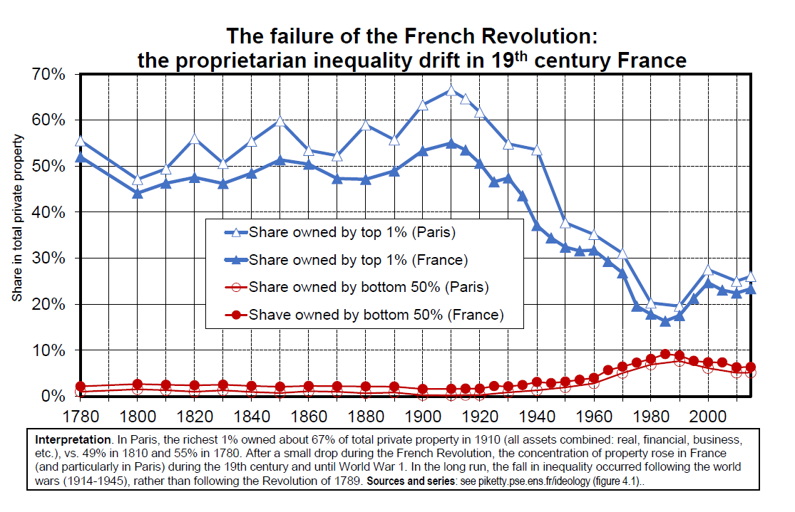

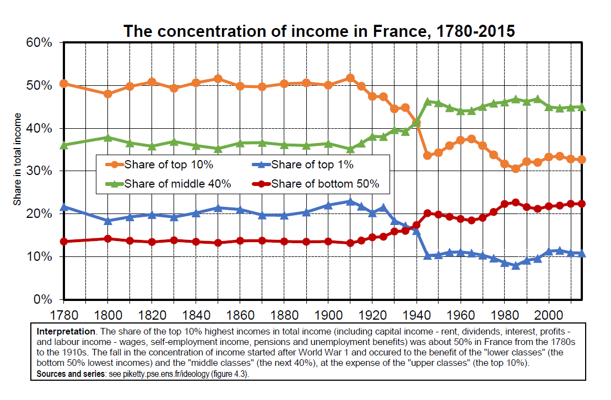


* It is worth emphasizing that high wealth inequality in 1880-1914
corresponds to a « modern » and dynamic property structure; lots of
financial assets, especially foreign financial assets

* Nothing to do with old-style rentiers based on land

* This was also a period of large innovations: automobile, electricity, radio, transatlantic transportation, etc.

* In order to reach the level of stock market capitalization observed in Paris and London in 1880-1914, one needs to wait until 2000-2020
$\rightarrow$ **Extreme and rising inequality during Europe’s Belle Epoque (1880-1914) shows that « modernity » and a vibrant market economy can come with enormous inequality and social tensions (domestic and external)**

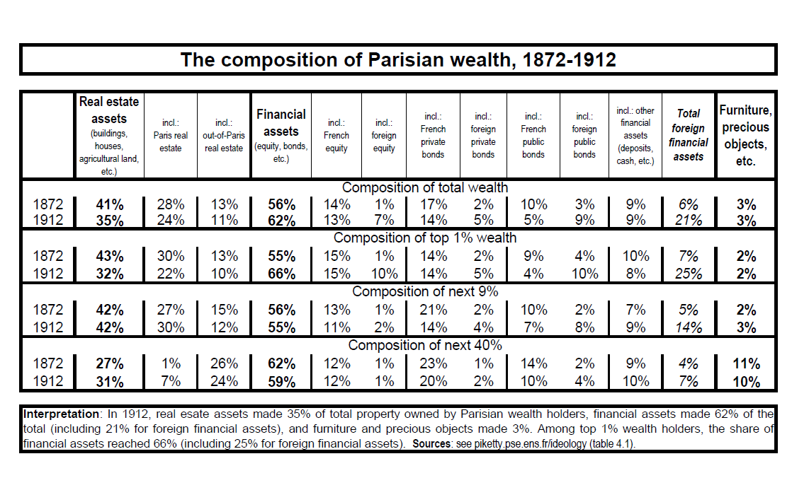

### Flat tax in 19c France: accumulation in peace

* Main explanation for rising inequality in 19c: legal and fiscal system was highly favourable to large property owners

* The new tax system created by the French revolution consisted of:\
**(1) A flat tax on inheritance: 1% from parents to children, irrespective of the level.** It was finally transformed into a progressive tax on inheritance, with a top tax rate equal to 2,5% in 1901, 5% in 1902 and 6,5% in 1910 (it is only after WW1 than top rates reached much higher levels)\
**(2) A system of direct taxation based on flat taxation of property at very low rates (about 0,2-0,3%) and no declaration of income:** taxe foncière (real-estate tax), taxe sur les portes & fenêtres (doors and windows), taxe professionnelle (business tax), taxe personnelle et mobilière (housing tax) (= « les quatres vieilles », « the four old taxes », applied in 1790-1914 until the creation of income tax in 1914, with a 2% top tax rate)


* Over 1790-1914 period, the average rate of taxe foncière was about 0,2%- 0,3% (today the average rate of taxe foncière in France or property tax in the US is about 0,3%-0,5% of property values)

* Like the property tax in the US and in other countries, the taxe foncière applies not only to residential real estate but also to business real estate: offices, warehouses, factories, etc. But because it is a flat tax, there is no need to compute the total property owned by a given individual.
$\rightarrow$ a property tax can be the best or the worst of all tax systems for large property owners:
- If it’s a flat tax system with very low rates (<1%), then this is the best of all systems: no need to report incomes and profits, accumulation in peace
- But if it’s progressive tax system (say from 0% for low wealth to 90% for large fortunes, like land reform and exceptionnal wealth taxes during 20c), then this is the most frightening of all taxes for property owners: in effect, this can lead to complete and permanent redistribution of property


* A progressive income tax was finally adopted by French Senate on
July 15 1914 in order to pay for the war with Germany

* In effect, France was one the very last developped countries to adopt
the progressive income tax: Denmark 1870, Japan 1887, Prussia 1891,
Sweden 1903, UK 1909, US 1913...

* Typical justification of the French elites of the time: France is a very egalitarian country thanks to the French Revolution, so we do not
need progressive taxation, unlike other countries...

* But the data shows that inequality was huge in pre-WW1 France!

* Ideology and beliefs systems matter: similar grand narratives about
« US exceptionnalism » also play a role today to justify huge levels of
inequality in the US


### The weight of the clergy and nobility: European variants, 16c-19c

* The French case if relatively specific: very sharp discontinuity between Ancien Regime ternary society and post-French Revolution proprietarian society

* Many countries display more gradual transition from ternary to proprietarian ideologies and institutions: we’ll have a closer look at Britain and Sweden

* Some other European countries (e.g. Spain & Portugal) display examples of much larger clerical and noble classes in 16c-19c

* This reflects different patterns of state formation (e.g. Reconquista)

* Moving out of ternary ideologies and institutions is always a complex and chaotic process: e.g. land reform in Spain 1932-1936 played a crucial role to mobilize the Catholic Church and large property owners against Republicans and largely contributed to Spanish Civil War

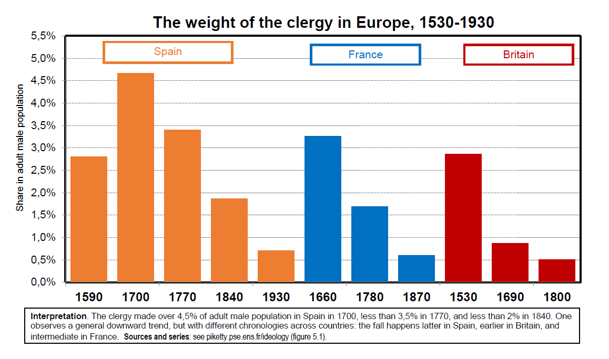
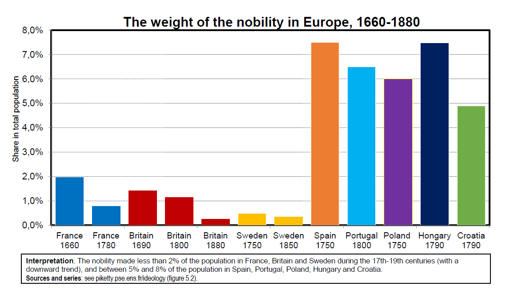

### From ternary to proprietarian societies: the case of the UK

* UK : perfect exemple of gradual evolution from ternary society to
proprietarian society (then to social-democratic society (Labour
party 1945) and to neo-proprietarian society (Thatcher 1980s)),
always with a Queen/King, a House of Lords and stable institutions ( $\neq$ France: opposite extreme: revolutions in 1789, 1848, 1871, etc)

* But British gradualism should not be exagerated: key role played by
major crisis and uncertain trajectories and offshoots, e.g. during the
battle over the People’s Budget in 1909-1911 ($\rightarrow$ rise of progressive taxation, fall of the House of Lords) and over Ireland 1860-1920 ($\rightarrow$ fall of proprietarian-colonial ideology)

* First major shock: Dissolution-expropriation of Monastries 1530.
Conflict between Henry VIII and the pope.

* Ecclesiastical land and other property expropriated and sold to
nobility and bourgeoisie ($\approx$ French Revolution, but much earlier)
 
* Huge reduction of the number of spiritual vs temporal lords in
House of Lords: half-half in 14c-15c, as opposed to 460 temporal
lords (nobility) vs 28 spiritual lords (bishops) in 17c-19c\

$\rightarrow$ already a decisive step away from trifunctionnal society (based upon a relative balance of power beween clergy and nobility) and
toward proprietarian society and ideology


* More generally, Britain has long been characterized by an unusually high concentration of land and other property among a very tiny nobility

* Around 1880, 80% of UK land owned by 7000 families (<0,1% population),
including over 50% of UK land owned by 250 families (<0,01% pop) (in comparison, French nobility owns only 25%-30% of land in 1789)

* The House of Lords (a few hundred families with hereditary seats) has veto power over all legislation until 1909-1911

* Almost all Prime Ministers come from House of Lords until late 19c-early 20c (Lord Salisbury, PM 1885-1892 and 1895-1902)

* The House of Commons also included many members of nobility: oldest sons of Lords waiting for their seat in House of Lords; youngest sons of Lords choosing a political career in the Commons; other members of titled nobility (baronets, knights) and untitled nobility (gentry)

* Until early 1860s, about 75% of the members of House of Commons belong
to the nobility (<0,5% of the population)


* The battle for universal suffrage in Britain: about 5% of adult males have the right to vote in 1820s $\rightarrow$ 14% after the 1832 electoral reform $\rightarrow$ 30% after the 1867 reform $\rightarrow$ 60% after the 1884 reform

* Other key reform: vote secrecy 1872 (before that: many uncontested seats) $\rightarrow$ between the 1860s and 1880s, massive democratization of the House of Commons $\rightarrow$ increased political legitimacy of House of Commons, pro-people turn of the Liberal Party (ex-Whigs) (replaced by Labour Party during 20c) ($\rightarrow$ 100% male suffrage UK 1918, female 1928) (more gradual process in the UK than in France: 1% 1815-1848 (censitary monarchies) $\rightarrow$ 100% 1871 Third Republic)

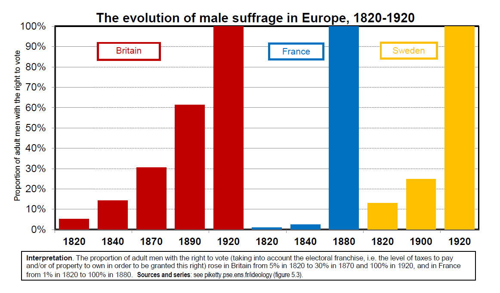

### The People’s Budget, Ireland and the fall of the House of Lords (1909-1911)

* But House of Lords still had veto power over all laws until the crisis of 1909-1911

* 1894: Lord Salisbury’s referendum theory: « If the Commons pass a law that was not explicitely annouced to the electorate before the election, then the Lords have the legitimacy to oppose it »\
$\rightarrow$ Lords from Conservative Party (Tories) put their veto on Gladstone (Liberal) bill on Ireland and regain power in 1895

* But in 1909 Liberals (Lloyd George) are back to power and provoke the Lords by adopting the « People’s Budget »: creation of a general progressive income tax, increased land tax and inheritance taxes on large property owners, so as to pay for a large rise in social spending (pensions etc.)

* Very popular bill, but Lords choose to put their veto on the People’s Budget

* Lloyd George then asks the Commons to adopt a constitutionnal bill stating that Lords will not be able to veto money bills any more (and can veto other bills for at most one year) $\rightarrow$ new veto by the Lords $\rightarrow$ Lloyd George calls for new elections

* Liberals win again the elections, and the Lords finally accept in 1911
to vote the People’s Budget and the constitutionnal law (under threat
by George V to nominate 500 new Lords) (see Cannadine, The decline and fall of British aristocracy, YUP 1990)\
\
$\rightarrow$ beginning of a long process leading to a large reduction of inequality in Britain 1914-1970: rise of top progressive tax rates (up to 98% in post-WW2 period), absolute majority at the Commons for Labour Party in 1945, creation of National Health Service, etc.

* Other important step in the weakening of UK proprietarian ideology: the Ireland crisis

* Ireland in the 19c: quasi-colonial situation. Limited political rights for the Catholic majority (landless peasants) + huge concentration of land among absentee landlords (British Lords)

* 1845-1848 famine: 1M died + 1,5M emigrated out of total pop of 8M
(comparable in magnitude and ideology to Bengal famine 1943-1944:
4M died out of 50M) (see Sen, Poverty and famines, OUP 1981)

* Beginning in 1860s-1870s, strong Irish movement to occupy parcels, stop paying rent and push the British landlords out\
$\rightarrow$ long sequence of « anti-terrorists bills » but also of Irish Land Acts 1870, 1891, 1903 gradually freezing rent payments and allowing peasants to purchase land at subsidized prices\
$\rightarrow$  step-by-step, these laws weaken the legitimacy of proprietarian ideology and lead to substantial land redistribution in a legal form, even before Irish Independance 1921-1937


### One man, 100 votes: extreme censitary inequality in Sweden (1865-1911)

* Sweden is generally regarded as a country with strong cultural
egatirarian roots

* But in 1865-1911 it was the opposite: Sweden had the most extreme
censitary inequality system in Europe

* Key lesson: there is no egalitarian or inegalitarian culture as such

* Inequality regimes depend on the balance of power between different social groups and political ideologies, and the prevailing equilibrium and dominant discourse can change very fast, in one way
or another

* Swedish Riksdag 1527-1865: four parliamentary chambers in order to
represent the nobility, the clergy, the urban bourgeoisie and the land-
owning peasantry. Separate votes among the four orders (like in French
Etats généraux), but nobility over-represented in committees and governement, and king has decisive vote in case of tied vote 2-2

* As compared to France and Britain, Sweden had centralized censuses giving an official definition to the four orders, and in particular to the nobility (<0,5% population)

* 1865 constitutional reform: upper house elected by large property owners (<1% population), lower house elected by broader group ($\approx$ 20% population), but with graduated voting rights depending on one’s taxes and property (fyrkar formula): from 1 vote to 100 votes in national elections

* In municipal elections, there was no maximum number of votes: very large property owners could have an infinite number of votes

* In effect, there were sevel dozen municipalities in Sweden where one voter had more than 50% of the voting right (including the municipality of the Prime Minister in the 1880s, Earl Arvid Posse)

* Corporations also had the right to vote in municipal elections, in proportion to their assets and the taxes they paid

* Electoral reform in 1911, universal suffrage 1919-1921: huge popular
mobilisation, social-democrats took power almost permanently in 1932-
2004 and used the country’s state capacity and administration for a
completely different political project, so that Sweden became highly
egalitarian (and also much richer)

### Europe’s proprietarian societies during the Belle Epoque (1880-1914)

* Different trajectories, but relatively similar outcomes: in 1880-1914,
whether one looks at France, Britain, Sweden or other countries for
which adequate data sources are available, one finds that European
societies are characterized as highly unequal proprietarian societies

* Typically: top 10% wealth share around 80%-90% of total wealth,
including 60%-70% for the top 1% wealth share, rising until 1914

* Huge inequality, enormous social tensions, rise of socialists,
communists and labour movements


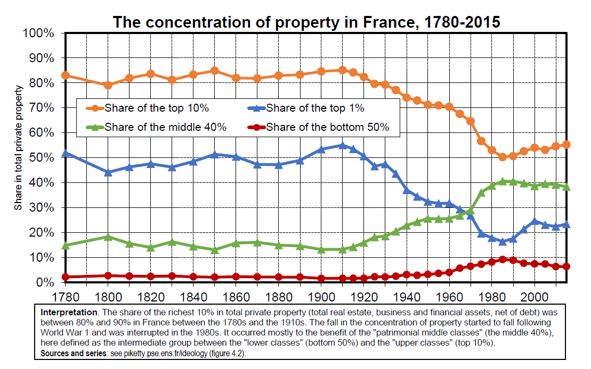
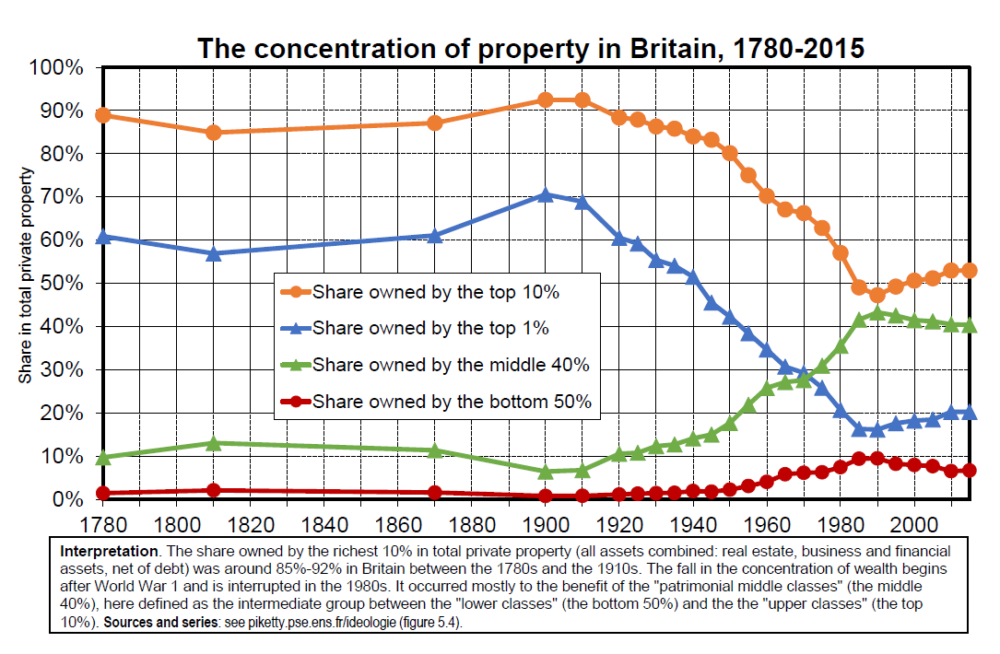
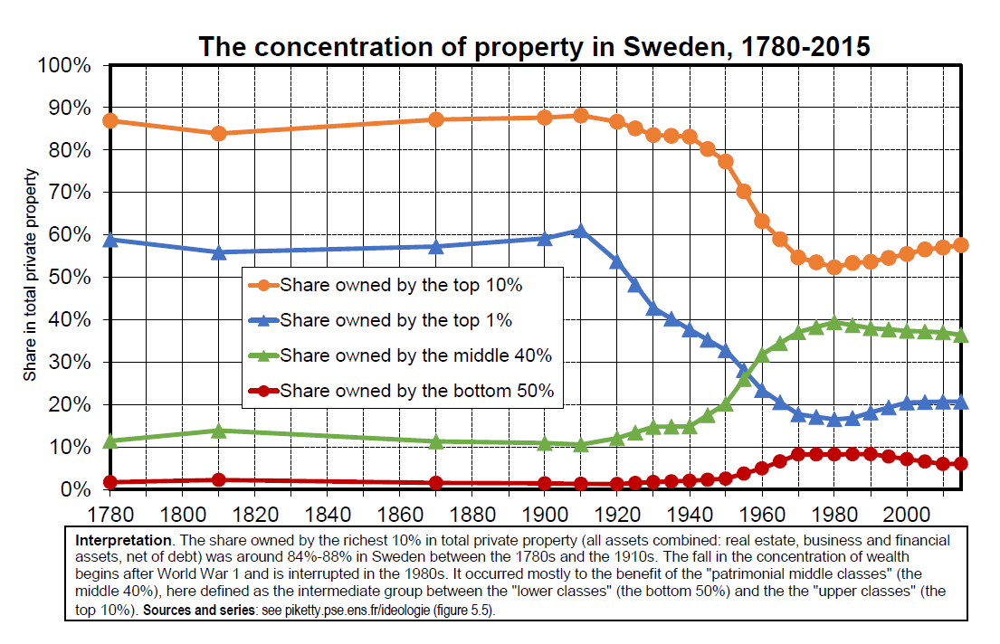
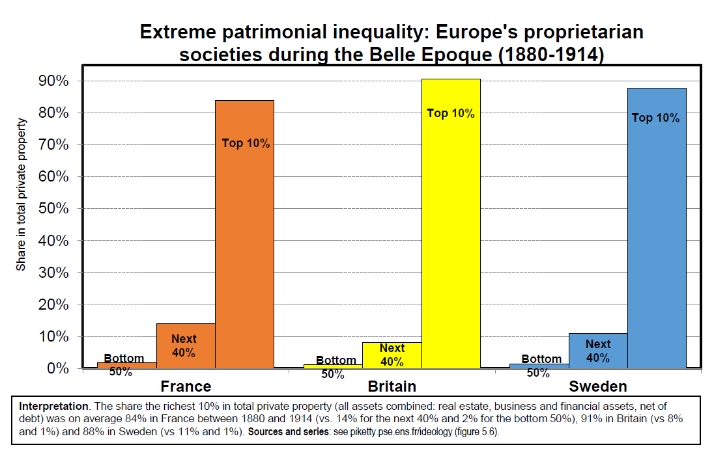

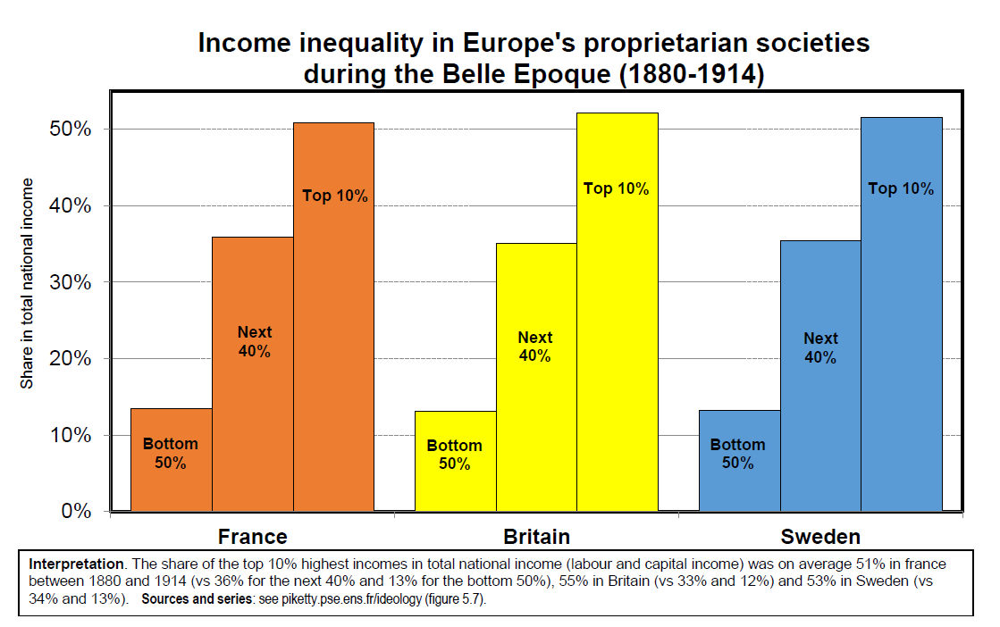

* Europe’s proprietarian societies 1880-1914 were also characterized by
enormous international inequalities

* Major role of foreign assets, especially for the dominant colonial empires (Britain, France)

* Huge external tensions: rising rivalry between European powers (Germany vs France-Britain) + beginning of independance movements\
$\rightarrow$ before studying the fall of proprietarian societies (1914-1945), we first need to study the role by slavery and colonialism in the transition from ternary to
proprietarian societies (15c-20c)