```{r setup, include=FALSE}
knitr::opts_chunk$set(echo = TRUE)
```


# Slave societies, abolitions and colonialism (Caribbean, US, Brasil, Africa)
\

### Societies with slaves vs slave societies

* **Slavery = most extreme form of inequality; forced labour: widespread in all premodern societies; there’s a continuum between different forms of forced labour**

* The notion of « slave society » (M. Finley, Ancient Slavery & Modern Ideology, 1979)

* « **Societies with slaves** » (i.e. societies where slavery exists but plays minor role: typically, slaves = a few % of total pop)
$\neq$ « **Slave societies** » : societies where slaves play a major role in the overall structure of population, production & property: say, societies where slaves make between 25% and 50% of total population

* According to Finley, slave societies are relatively rare in history: the main exemples are **ancient Greece and Rome** (slaves = 30-50% of total pop), **southern United States** (slaves = 40% of total pop until 1865), **Brasil** (slaves = 30-35% of total pop until 1888) (+ **British and French slave islands** : slaves = up to 90% of pop until abolition/compensation 1833-1848) (Haïti revolt 1791 $\rightarrow$ public debt 1825-1950

* Recent research: other slave societies = Kongo 15-16 c , Sokoto 18-19 c , Sumatra 17 c (30-50%) (also, in most societies, slaves are part of a graduated serfs-elites inequality regimes)

```{r echo=FALSE, , fig.align='center', out.width="100%"}
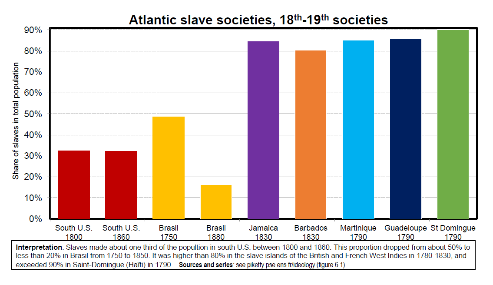
```

### Britain: the abolition-compensation of 1833-1843

* Slave trade ended in 1807 by Britain; slavery abolished in
1833-1843 in British colonies

* Abolition law voted in 1833 but applied gradually:
sophisticated system of compensation to slave owners

* Key role played by bloody slave revolts in Jamaica 1831,
following Guyana 1815, Guadeloupe 1802, Haiti 1791

* Total emancipated in 1833-1843: about 800,000 slaves
(incl. about 700,000 in West Indies)

* Main concentrations of slaves within British Empire 1780-1840:
  + British Caribbean (« West Indies »): Jamaica, Trinidad & Tobago, Barbados, Bahamas, etc.
[$\neq$ French Antilles: Martinique, Guadeloupe, etc.]
[$\neq$ two largest Caribbean islands: Cuba (Spain, slave trade until 1867, slavery until 1886) & Hispaniola (Haiti/Dominican Rep.)]
  + Indian Ocean: Mauritius (« Ile de France » until 1810, then
became British) [$\neq$ Reunion, « Ile Bourbon », remained French]
  + Cape colony (South Africa)


* **1833 law** introduced financial compensation for slave owners (not for slaves!) **= an extreme illustration of the 19 c regime of private property sacralization**

* 20 million £ were paid to 3000 slave owners: about 5% of British GDP of the time, financed by increased public debt, i.e. by British tax revenues (mostly indirect taxation). Equivalent to 10 years of education budget of the time!

* Equivalent to about 100 billions euros today (5% GDP), i.e. average payment of about 30 million euros to each of the 3000 slave owners.

* Complete list of recipients and historical analysis on "The Legacies of British
Slave-ownership" website (UCL history dept project) (released in 2013, big public scandal, several well-known British families were on the list, including a cousin of Conservative PM Cameron)

* See N. Draper, The Price of Emancipation: Slave-Ownership, Compensation and British Society at the End of Slavery, CUP 2010; C. Hall et al, Legacies of British Slave-Ownership: Colonial Slavery and the Formation of Victorian Britain, 2014

* **Basic justification of compensation to slave-owners during 1831-33 debates:**\
if slave-owners loose entirely their property, with no compensation, then what about those who sold their slaves a few weeks or years before and now possess financial assets or real estate?

* I.e. if we expropriate slave owners without a proper compensation, then we are going to open the Pandora’s box of property rights in general, and we will never know where to stop; therefore we should have full compensation

* **Same basic « Pandora’s box » argument as during the French Revolution about « corvées » and during the Irish debate about land redistribution:** do not question property rights acquired in the past, otherwise you’ll end up with a complete destruction of proprietarian prosperity and social order


* **Same arguments in France during the 1843-1848 debates about abolition: for « liberal » thinkers like Tocqueville or Schoelcher, it was unthinkable to expropriate slave owners without a fair compensation** (given that slaves
were acquired in a legal way in the past) 

* 1848 abolition: compensation at half of market price + former slaves were forced to produce a long term labor contracts as plantation workers or domestic servants (otherwise arrested for vagrancy)

* On 18c-19c debates about abolition, see Oudin-Steiner, Calcul et morale – Coûts de l’esclavage et valeur de l’émancipation (18 e -19 e siècles), 2015

* On post-abolition labor regimes, see Stanziani “Beyond colonialism: servants, wage earners and indentured migrants in rural France and on Reunion Island (c. 1750–1900)”, Labor History 2013; Allen, « Slaves, Abolitionism & the Global Origins of the Post-Emancipation Indentured Labor System », Slavery & Abolition 2014


* **What would have been a fair solution to the 19c abolition problem?**

* A compensation to slaves for centuries of unpaid labour and bad treatment, e.g. through the form of a land allocation (and/or pension: Condorcet 1781)

* No compensation at all for slave-owners + a general progressive tax on all property owners (e.g. large industrial owners also benefited from slavery) in order to finance the compensation to slaves

* Not impossible to organize, but this would have required a radical questionning of proprietarian ideology and the development of ambitious forms of progressive taxation that were not experimented before the 20th century (but were already discussed in the 18th century)

### France: the two-step abolition of 1794-1848 & the case of Haïti

* French Revolution abolished slavery in 1794, after a major slave revolt in Saint Domingue (Haïti) (=the largest world concentration of slaves at the time)

* But slavery was re-established in 1802; finally abolished in 1848

* In Haïti, slaves took seriously the French revolution: Haïti revolt 1791, independance 1804 $\rightarrow$ in 1825, France finally « accepts » Haïti independance, but imposes a large public debt on Haïti as the price for their freedom (150
millions Francs or about 2% French GDP of the time)

* Haïti had to repay this huge public debt (about 300% of Haïti’s GDP) until World War 2; in effect, interest payments on Haïti’s public debt were compensating former French slave owners for lost profits due to emancipation

* The compensation was paid to Caisse des Dépôts (French govt bank) and then distributed to slave owners

```{r echo=FALSE, , fig.align='center', out.width="75%"}
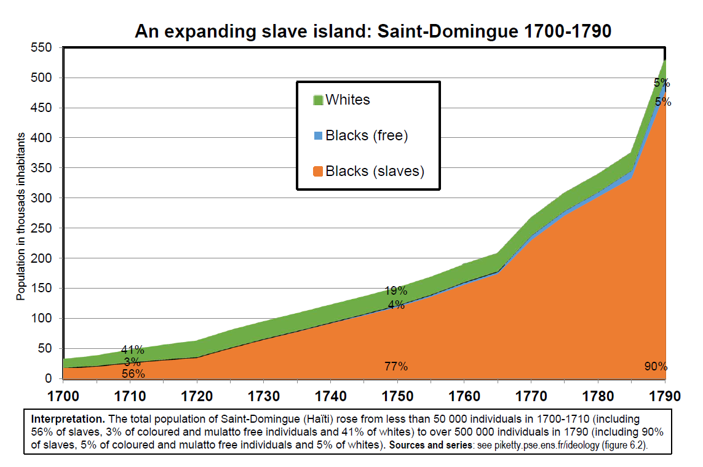
```


* Modern debates about compensation to Haiti: in 2004, French president did not attend bicentennial ceremonies for Haiti’s independance in order to avoid financial claims (in 1904, French authorities also did not attend because they felt Haiti was not paying fast enough!)

* In 2001 French law recognizing slavery as crime against mankind, Taubira tried to introduce an article 5 on reparations and land reform in former French slave islands (so that descendants of slaves stop paying rent to descendants of slave-owners). But it was not adopted. New failed
attempt by Taubira to raise the issue in 2015.

* US 1988 law: 20 000$ compensation to Japanese-Americans detained during World War 2. But no compensation was ever paid to former slaves (Africans-Americans), or for expelled Mexicans-Americans during 1930s.

### USA: abolition through war (1861-1865)

* Abolition of slave trade in 1807, but US slavery system prospered until Civil War 1861-1865 & abolition of slavery in 1865. Legal racial discrimination for school, transport, housing, jobs, voting rights etc. in Southern US until 1960s.

* 1800: total US pop 5,2m
  + US South 2,6 millions = 1,7m whites + 0,9m slaves (33%) 
  + US North 2,6m = total 

* 1860: total US pop 31,2m 
  + South 12,2 millions = 8,1m whites + 4,1m slaves (33%)
  + US North 18,9m = total 

* No slave trade, but large natural reproduction: n. slaves multiplied by >4

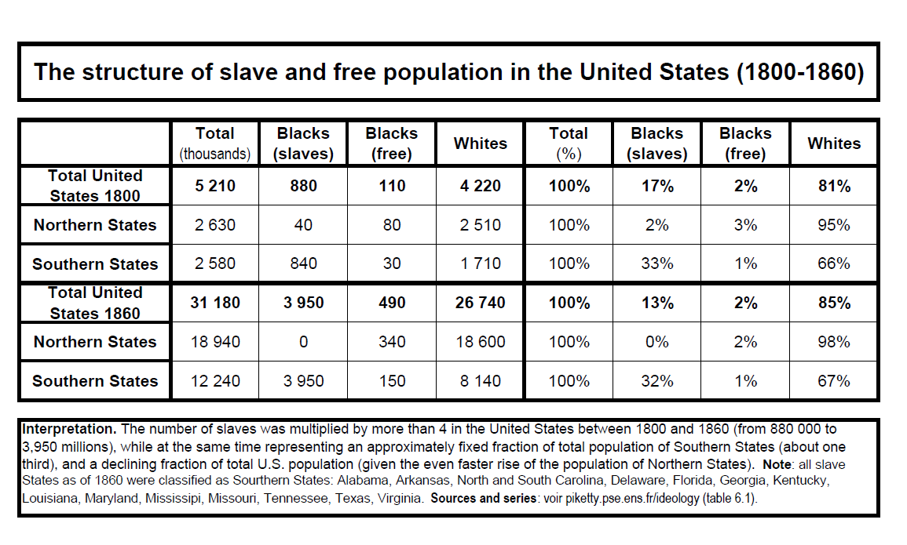
* **Key role of slavery in US history:** out of the 15 first presidents, 13 were
slave owners (including Washinton, Jefferson, etc.)

* Slaves very well recorded in US censuses because they give more seats in US Congress: three-fifths rule

* Virginia: largest slave state, and by far largest US state in 1800

* In the 1850s, 75% of cotton used in European textile factories comes from US south $\rightarrow$ **key role in the overall industrialization process**

* In some states (e.g. South Carolina), the proportion of slaves rose up to 55%-60% in the 1850s. In Virginia, stable around 40%.

* Very large slave concentrations, but less extreme that in Caribbean islands

* Very strong repression: laws in the 1830s-1850s putting in jail those who teach reading/writing to slaves and those who help fugitives\
 $\rightarrow$ **rising tensions between slave states and free states**

```{r echo=FALSE, , fig.align='center', out.width="90%"}
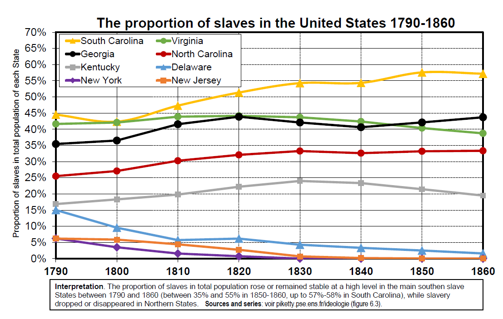
```
* **Jefferson 1820: OK with abolition, but only if full compensation** to owners (self-evident from owners’ viewpoint) and **if we can send slaves back to Africa** (American Colonization Society, Liberia) (=extreme form of separation).

* « I tremble for my country when I reflect that God is just, and that his justice cannot sleep forever (...). The cessation of that kind of property would not cost me a second thought if a general emancipation and expatriation could be effected; and gradually, and with due sacrifices, I think it might be. But as it is, **we have a wolf by the ears, and we can neither hold him, nor safely let him go**. Justice is in one scale, self-preservation in the other ».

* **Calhoun 1837** in Slavery as a positive good has a more positive justification of
slavery: **« there is more misery among the poor, sick and elderly in the urban
proletariat of Europe and North-East US than in the South slave society **»; « Boston capitalists pretend that they want to free the slaves, but all they want is cheap labor, which they will throw away when they don’t need it any more »

* **Was a peaceful end to US slavery possible?**

* Total market value of slaves in 19c US: about 100% of US national income (and >250% of South US national income)

* By comparaison, UK compensation to slave owners: 5% national income in 1833-43. Total public debt due by US Civil war 1861-65: <30% national income

* In 19c US, slave-owners and Democratic party leaders (Jefferson, Monroe, etc.) made such computations and started to draft plans about massive land transfers from new western states to former slave-owners. But the scale of the wealth transfer to compensate slave-owners was unrealistic (& unfair).

* Lincoln 1860: elected on a platform putting an end to the extension of slavery in the West, and proposing a gradual emancipation (with compensation) to the South. But everybody knew that a full compensation was impossible, and that the South was becoming a shrinking minority within the US Congress $\rightarrow$ secession attempt by Southern states, Civil War 1861-65

* **A fair and peaceful end would have required a radical rethinking of property regime, with large transfers both to former slaves and poor Southern whites, so as to create common interest between them (not easy)**

* In 1863-1864, a transfer to former slaves (« 40 acres of land and a mule ») was promised by Northern troops in order to mobilize African Americans, but the promise was quickly forgotten after the war

### The Democratic party, from slavery to New Deal

* **The US party system is often viewed as very bizarre from theperspective of « European », « standard » left vs right view of politics. But maybe it is not so bizarre if we take a very long-run perspective.**

* How is it that the pro-slavery party (Democrats in 1860) gradually became the New Deal party (Roosevelt 1932) and the Progressives/Civil Rights/Left-wing party (Kennedy/Clinton/Obama)? And also more recently the high-education, high-income party.

* And conversely how is it that the free-labour party (Lincoln’s Republicans in 1860) gradually became the pro-business pro-laissez-faire party (Hoover 1928) and the anti-minority party (Trump 2016)? And also more recently the pro-white-poor party ($\approx$ Democrats 19c).

* To understand these evolutions one needs a multi-dimensional view of politics: income vs race vs regionalism vs money vs free-trade etc.

* There is nothing « normal » in one-dimensional class-based conflict

* N. Barreyre, L’or et la liberté – Une histoire spatiale des Etats-Unis après la guerre de sécession (Ed. EHESS 2014)

* Gold and freedom – The political economy of reconstruction (Un.Virginia Press 2015)

* Very interesting book on the changing structure of US political conflict 1860-1884

* Q.: How did the Democrats (who lost 1860 election against Lincoln’s Republicans and lost the Civil War) manage to reconstruct themselves and win the 1884 presid. election?

* A.: New South-Midwest coalition against the blacks and against the North-East financial elite (free-labour capitalism Republican ideology not well suited to adress all issues).

* **Free-labour Republican coalition quickly looses its majority, first because divided Reps soon abandon the South to segregationnists democrats**: by 1868-1870, end of any serious attempt to impose racial equality and black suffrage; 14th amendment never applied, partly because Reps were strongly
attached literacy tests on Irish migrants in Mass and NY (Democrats favour Irish naturalization & white migrants in the North and black lynching in the South)

* **And next because on the two other major policy issues of the day** (war debt repayment: hard vs soft money, interest vs veteran pension; manufacturing protection/federal tariff vs free trade/no federal tax), **Democrats are able to attract lower-class & middle-class white voters from the West and the North- East by describing the Republicans as captured by North-East financial/manufacturing elite**

* **1884 Democrat winning coalition: already the flavour of the New Deal « left- wing » 1932 coalition... except that strongly anti-black** (until 1960-1964, when South vote turn from Dems to Reps)

* **Between the 1940s and 1960s, Democrats choose to turn pro-Civil rights and to loose the South. Why?**

* **International factors**: post-WW2 cold war context, anti-Nazi coalition with Soviet Union, decolonization, competition with USSR for moral leadership and prestige. Being openly racist is very costly on the international scene in the
1950s-1960s. In the 1980s, Reps still oppose sanctions against Apartheid regime in South Regime, but not the Democrats: complete change as compared to 1860-1930.

* **Domestic factors**: the post-Great-Depression New Deal social policy platform (social security, health and unemployment insurance, progressive taxation, etc.) favours all the poor, black and white; so it makes little sense for the New
Deal party to seek support from poor whites and not from poor blacks

### Brasil: a late abolition (1888)

* Brasil: stable slave population 1,5-2 million 1800-1890 (slave share in total population declined from 50% in 18c to <20% in late 19c)

* Much more racial mixing and gradual emancipation than in the US

* Brasil census 2010: 48% of population self-describes itself as whites, 43% as mixed, 8% as black, 1% as other (genetic test: >90% population has mixed origins)

* 1888 abolition also involved complex debates and various compensation schemes to slave owners (1865: gradual emancipation of elderly slaves;\
1871: emancipation of new born slaves, with compensation)

* Constitutions of 1891, 1934 and 1946: only literate citizens can vote\
$\rightarrow$ 70% of pop excluded in 1900, 50% on 1950 and 20% in 1980\
$\rightarrow$ one needs to wait the end of military dictatorship (1964-1985) and the Constitution of 1988 to have truly universal suffrage in Brasil

```{r echo=FALSE, , fig.align='center', out.width="70%"}
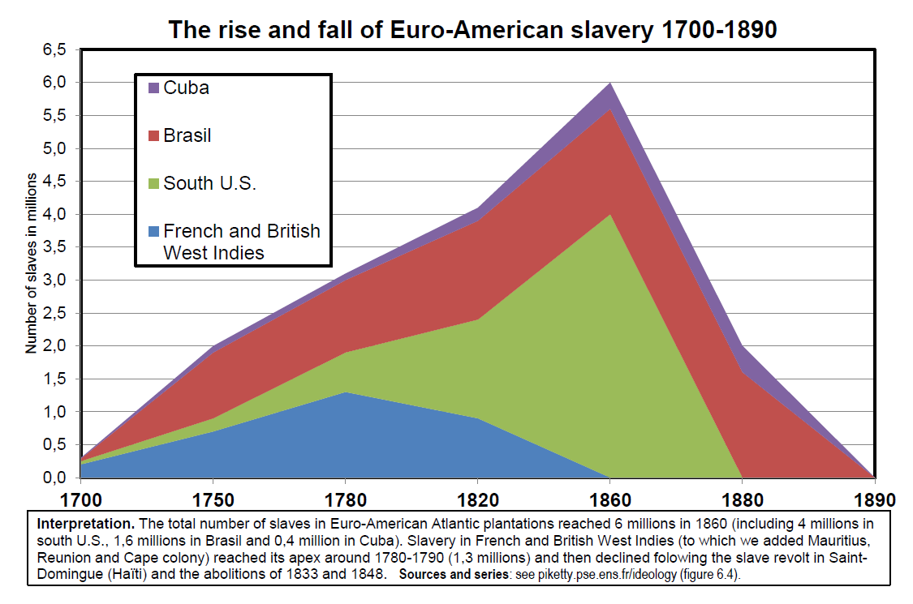
```

### Russia: the end of serfdom with a weak state (1861)

* Abolition of serfdom happened in 1861 in Russian empire, roughly at the same time as Civil war and abolition of slavery in the US

* Serfs: about 22 millions in Russia 1861, $\rightarrow$ 40% of population

* Gradual process with compensation to owners: in order to access communal lands, former serfs were supposed to make payments to owners for 49 years (until 1910).
In practice most payments stopped in 1880s, but former owners often kept substantial juridictionnal and political power over serfs.

* See e.g. Dennison, « Contract enforcement in Russian serf society, 1750–1860 », EHR 2013; ”The Institutional Framework of Serfdom in Russia: the View from 1861”, in Serfdom and Slavery in the European Economy, 11 th -18 th c., Firenze UP 2014\
\
$\rightarrow$ the Russian imperial state was too weak (very small central tax revenues) to compensate owners via public debt and taxation and to take control of juridictionnal/regalian functions at the local level. It takes a strong centralized state to move from trifonctional status-based societies to proprietary societies... or directly
to a communist society in the case of Russia.

### Extreme inequality: slave vs colonial societies

* Two main stages in European colonialism:

* From 1500 to about 1800-1850: massive use of slavery, forced labour, population displacement (stage 1)

* From about 1800-1850 to 1960s: post-slavery colonialism, less violent forms of domination, but over much larger territories (stage 2)

* During stage 2, very sophisticated forms of administrative organization allowed European powers to control empires with very small population of settlers: 0,1%-0,4% of total population in India, Indochina, most of Africa

* Main exceptions: North Africa (especially Algeria) and South Africa, with as much as 10%-15% European population


```{r echo=FALSE, , fig.align='center', out.width="100%"}
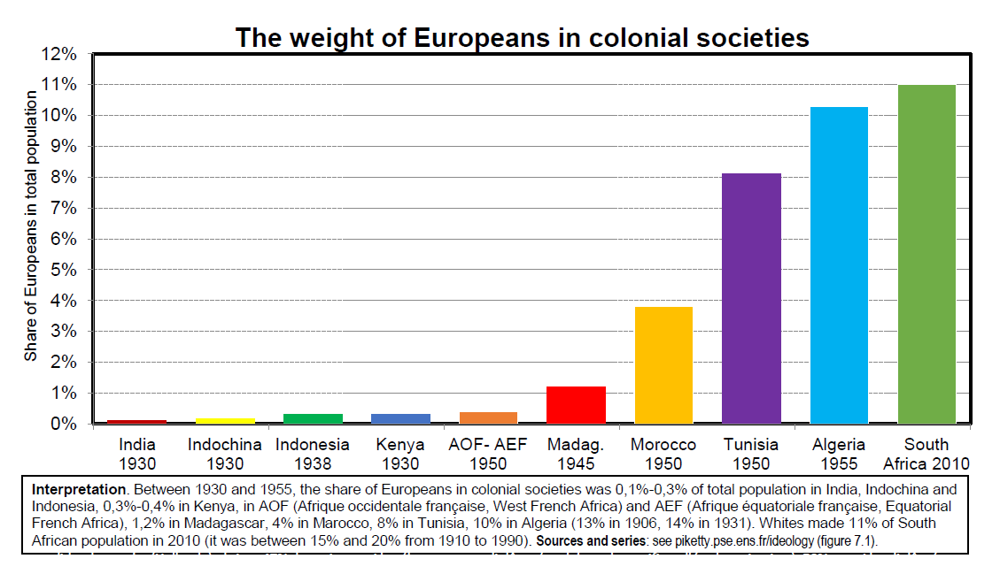
```
* Inequality can reach extreme levels in colonial societies, especially when the share of settlers is substantial

* In colonial Algeria or in South Africa under Apartheid, the top 10% income share can be as large as 70%

* In slave societies like Saint-Domingue, it can be larger than 80%: highest inequality level ever observed

* Generally speaking, the concentration of income and consumption cannot be as extreme as the concentration of property: the bottom 50% can live without property, but not without minimal consumption

```{r echo=FALSE, , fig.align='center', out.width="85%"}
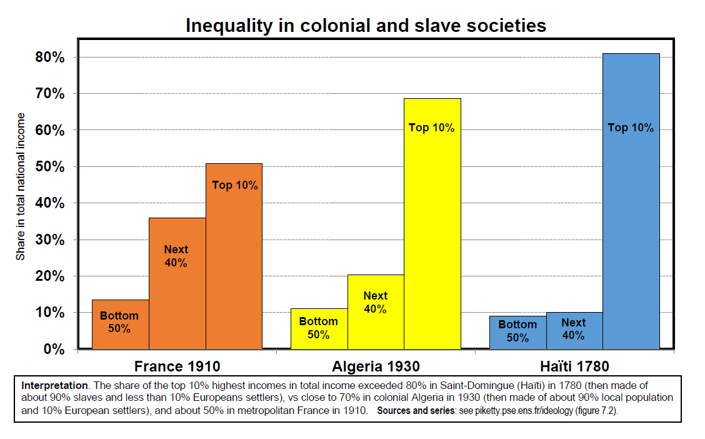
```

```{r echo=FALSE, , fig.align='center', out.width="85%"}
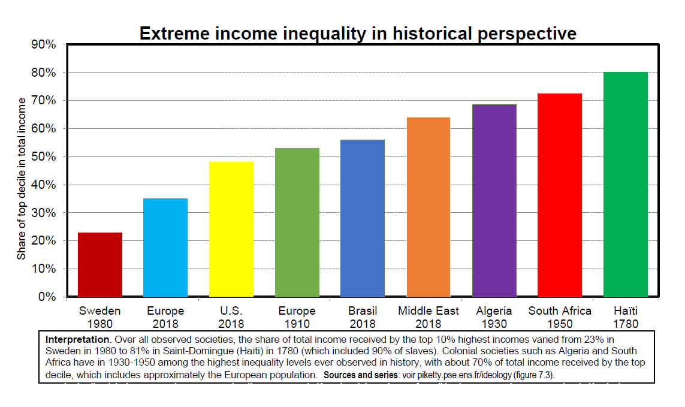
```


```{r echo=FALSE, , fig.align='center', out.width="75%"}
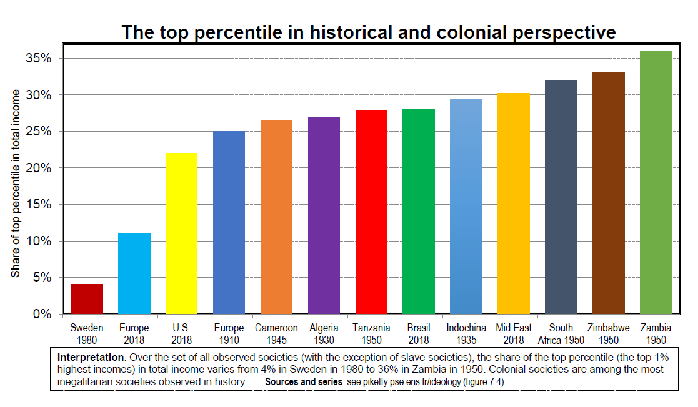
```

```{r echo=FALSE, , fig.align='center', out.width="75%"}
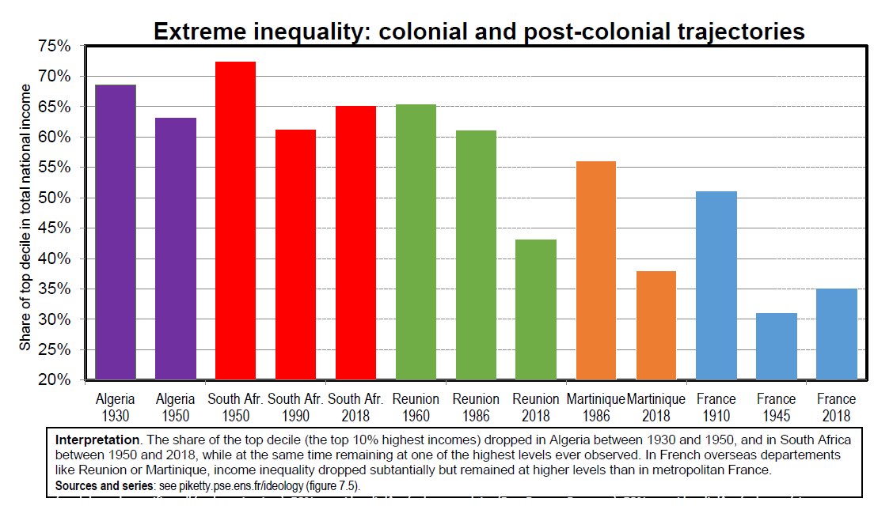
```

```{r echo=FALSE, , fig.align='center', out.width="75%"}
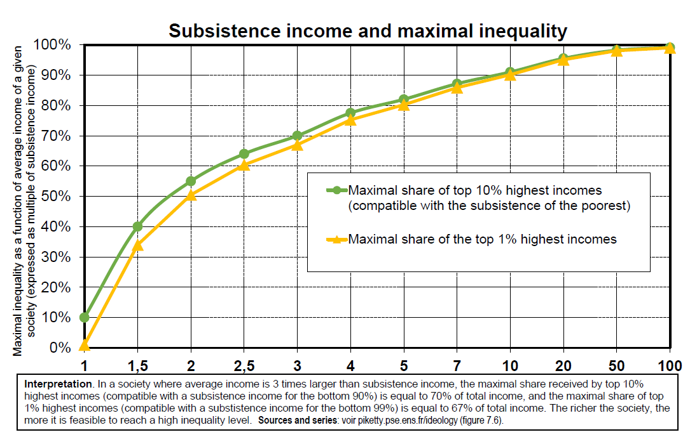
```


```{r echo=FALSE, , fig.align='center', out.width="75%"}
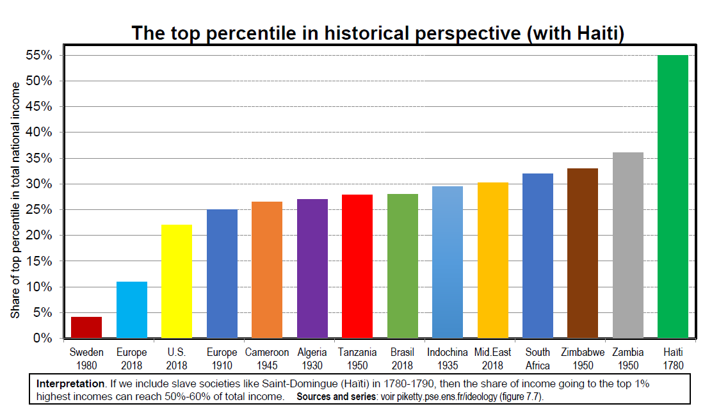
```

### Colonies for colonizers: recent research on colonial finances

* Why so much inequality in the colonies?

* The entire legal and fiscal system was strongly biased in favour of the colonizers

* E.g. there is forced labour in French colonies until 1946 (« prestations » according to 1912 legalization decree) ($\approx$ « corvées »)

* See M. Van Waijenburg, « Financing the African Colonial State: The Revenue Imperative and Forced Labour », JEH 2018

* During the 1920s-1930s, France refuses to ratify ILO charter in order to keep using forced labour for public works in Africa (railways in Congo, etc.)


* More generally, colonial finances were strongly biased in favour of colonizers: taxes paid by the colonized, but spending for the benefit of the colonizers

* See D. Cogneau, Y. Dupraz, S. Mesplé-Somps, “Fiscal Capacity and Dualism in Colonial States: The French Empire 1830-1962”, PSE 2018

* E.g. in Algeria, over 80% of total education budget is spent on schools only open to European settlers (10% of the population) in 1930-1950

* Education system was also very elitist in metopolitan France in 19c or early 20c, but not nearly much (<40% total spending for top 10%)

* The military costs of colonization were also very small (<0,5% GDP in 1830-1940) (up to 2% in 1945-1960 during independance wars)
\newpage

```{r echo=FALSE, , fig.align='center', out.width="75%"}
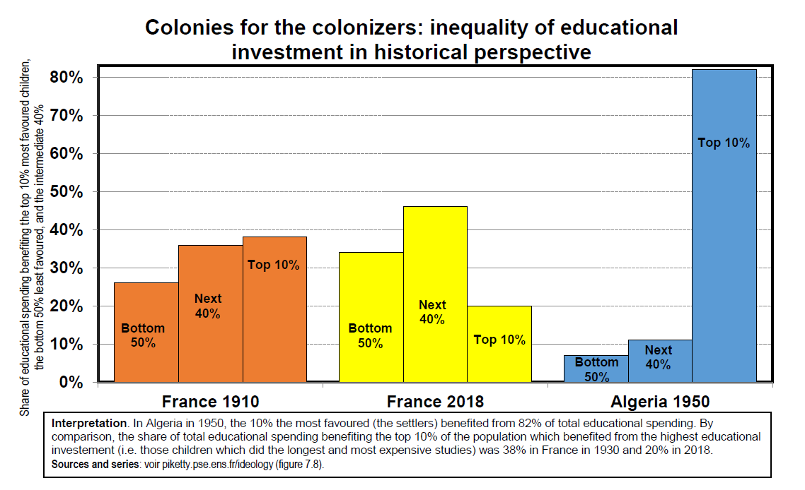
```

### Colonial-proprietarian inequality 1880-1914: the role of foreign assets

* Foreign assets owned by France and Britain reached 100%-200% of national income at the eve of World War 1

* These assets were partly accumulated out of colonial domination:\
public debt/war tributes in Haïti, China, Morocco, etc.

* These assets generated up to 5%-10% of additional national income each year in profits, interest, dividends, etc., and allowed France and Britain to have permanent trade deficit in 1880-1914, while at the same time accumulating more foreign assets\
\
$\rightarrow$ unsustainable trajectory in the long-run; greatly contributed to international tensions and to World wars 1 & 2

```{r echo=FALSE, , fig.align='center', out.width="75%"}
knitr::include_graphics("plot_3-14.png")
```

### Decolonization and the question of social-federalism

* F. Cooper, Citizenship between Empire and Nation: Remaking France and French Africa, 1945-1960, PUP 2014; Africa and the World – Capitalism, Empire, Nation- State, HUP 2014

* **In 1945-1960, a number of African leaders (Senghor in Senegal, Houphouët- Boigny in Ivory Coast, etc.) seriously considered the possibility of a democratic federation with France, including one-man-one-vote representation in a federal Parliament in Paris**

* **« With small African nation-states we will not be large enough to regulate global capitalist forces and to implement an equitable development strategy »**\
$\rightarrow$ long constitutional discussions with France about new « French Union », including dozens of representatives from ex-colonies in French National Assembly\
$\rightarrow$ but French leaders and voters would never have accepted to be put in a minority in such a federal Parliament... $\rightarrow$ **A West Africa federation would probably have been a more realistic and viable strategy**\
\
$\rightarrow$ An interesting historical episode to re-visit today’s European & global debates regarding federal political union