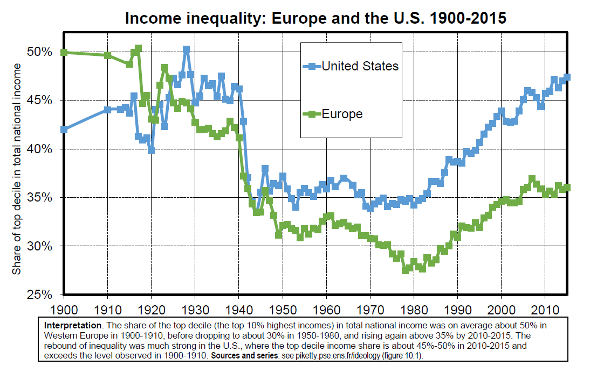
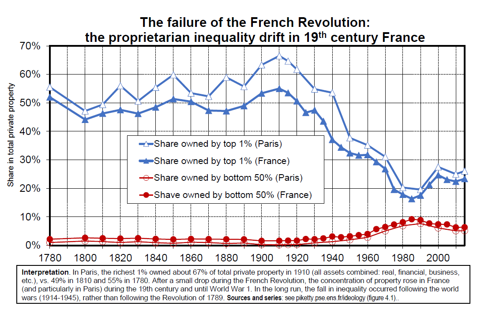

  
# The Great Transformation of the 20 th century: from proprietarian to social-democratic societies

### K. Polanyi and the « Great Transformation » (1944)

* **K. Polanyi, The Great Transformation: The Political and Economic Origins of our Time (1944)**: the 19 c capitalist system was inherently unstable; this finally led to the self-destruction on European societies in 1914-1945 & the death of 19c economic liberalism and laissez-faire ideology

* Hungarian economic historian, took refuge in London 1933 & NYC 1940-1944

* 19c regime: sacralisation of market system and private property + generalized competition between individuals and between European nations-states\
$\rightarrow$ very unequal & unstable system, both within and between countries\
$\rightarrow$ wars, revolutions, monetary chaos, fascism

* Key pb = **myth of self-regulated markets for labor, land and money**
The solution is democratic socialism, i.e. the “social embeddedness of markets” (market economy with democratic regulation of the markets for labor, land and money/capital) (but the book focuses mostly on historical analysis) (+over-optimistic view of pre-industrial restrictions on labor mobility?) 
 
* **H. Arendt, The Origins of Totalitarianism 1951:**\
same basic premises as Polanyi 1944: generalized market competition 1815-1914 led to self-destruction of European nation-states in 1914-1945

* Arendt stresses **the need for post-national federations to regulate globalized capitalism** = what colonial British & French empires did in a hierarchical way; what Bolsheviks and Nazis did in a totalitarian manner; what the US do in a constitutional & relatively democratic manner

* **European social-democratic nation-states were too small to control & regulate global economic forces.** European social-democratic parties (SPD, Labour, French socialists, etc.) were internationalist in their discourse but not in their political project (nation-centered, lack of federalist dimension).

* This 1951 analysis seems quite relevant for 2019-2020

* O. Rosenboim, **The Emergence of Globalism. Visions of World Order in Britain and the United States 1939-1950**. Princeton UP 2017

* Between colonial empires and the cold war: new federal visions of world orders emerge (UN 1945: less ambitious version of these discusions)

* **UK movement Federal Union**: very active in 1938-1940

* April 1940 meeting in Paris between British & French economists to prepare a possible federal union between Britain, France and beyond

* **But wide disagreements about the economic content of federal union**:

* Beveridge, Wooton: social insurance, federal progressive tax on high incomes and inheritance (Socialism and Federation, 1941)

* Robbins: ok for federal progressive taxation in case the free movement of labour and trade within the federation is not sufficient to reduce inequality

* Hayek: the only objective of the federation must be to constitutionalize property rights & prevent redistribution (The Road to Serfdom, 1944; Law, legislation and liberty, 1982; pro-Pinochet in 1973-1990)

### The fall of inequality and private property (1914-1950)

* **Fall of top income shares 1914-1950, particularly in Europe**

* Rebound of inequality since 1980, especially in the US

* But inequality levels in Europe in 2010s are still much below pre-WW1 levels

* **The decline in income inequality during the 20c is largely due to the fall of top capital incomes**

* In contrast, the inequality of labour income has been relatively stable in the long-run, particularly in Europe ($\neq$ sharp rise in US since 1980s)

* Basic orders of magnitude. **Top 10% income share declined from 50% to 30- 35% of total income. Top 10% wealth share declined from 90% to 50-60% of total wealth**. Bottom & middle incomes are made of labour income, top incomes are made of capital income. Bottom wealth = liquidities, middle wealth = housing, top wealth = financial & business assets.
 
```{r echo=FALSE, , fig.align='center', out.width="100%"}

```

```{r echo=FALSE, , fig.align='center', out.width="100%"}

```

```{r echo=FALSE, , fig.align='center', out.width="100%"}

```

```{r echo=FALSE, , fig.align='center', out.width="100%"}

```

```{r echo=FALSE, , fig.align='center', out.width="100%"}

```

```{r echo=FALSE, , fig.align='center', out.width="100%"}

```

```{r echo=FALSE, , fig.align='center', out.width="100%"}

```

```{r echo=FALSE, , fig.align='center', out.width="100%"}

```

```{r echo=FALSE, , fig.align='center', out.width="100%"}

```
\newpage
* In order to understand the fall in top capital incomes during 20c, two mechanisms to distinguish:

1. The fall (& recovery) in aggregate private property. From 600%-800% of national income in 1880-1914, down to 200%-300% in 1950-1970, back up to 500%-600% by 2000-2020. But wealth concentration did not recover (yet).

2. The fall (& incomplete recovery) of the concentration of private property. In principle, the fall in aggregate private property could have affected all wealth levels in the same proportion, with unchanged wealth shares by decile. But: 
  + Assets held at the top (e.g. foreign wealth) were particularly affected.
  + Top wealth holders need their capital income to finance their savings & living standards; 20c shocks led to a collapse of their saving capacity; some even started to sell some of their assets so as maintain their living standards.
  + Progressive taxation of top income and top inheritance made it virtually impossible to return to the previous concentration.


```{r echo=FALSE, , fig.align='center', out.width="80%"}

```

```{r echo=FALSE, , fig.align='center', out.width="80%"}

```

```{r echo=FALSE, , fig.align='center', out.width="85%"}

```

* For detailed decompositions of the fall in aggregate private property between 1914 and 1945, see Piketty-Zucman,Capital is Back: Wealth-
Income Ratios in Rich Countries, 1700-2010, QJE 2014 (database) (and
Capital in the 21 st century, chapters 3-5)

* **Physical destructions** of capital: 25-30% of the 1914-1945 fall in France and German, <5% in Britain

* Other two main components explaining the fall ( about 50-50):

* **Lack of investment** (low private savings, most of which were absorbed to finance the public debt used to pay for the war)

* **Change in legal property regime**: nationalization, financial regulation, codetermination (power sharing beween shareholders and workerrepresentative in companies), rent control, etc. $\rightarrow$ decline in the market
value of assets (companies, real estate) for property owners, but not
necessarily of the real economic value of capital

### The removal of 20c public debt: inflation & exceptional wealth taxes

* In 1945-1950, public debt was about 200%-300% of national income in
Britain, France and Germany.\
In effect, between 1914 and 1945, private wealth holders have put a
large part of their assets into public debt in order to finance the war.

* This large public debt was never repaid to bond holders

* **Britain: gradual erosion by inflation 1945-1980**

* **France: very fast erosion by inflation in 1945-1950**

* **Germany: exceptionnal progressive taxes of large private wealth**
(real estate + financial, incl. public debt) were put in place in 1949-1952\
$\rightarrow$ **very fast reduction of public debt (<20% national income in 1950s- 1960s), without the negative distributional consequences of inflation ($\neq$ regressive wealth tax)**


```{r echo=FALSE, , fig.align='center', out.width="85%"}

```

```{r echo=FALSE, , fig.align='center', out.width="85%"}

```

* **Germany’s public debt removal 1949-1953: mixture of inflation** (much more moderate than Germany 1920s or France 1945-1949), **exceptionnal wealth taxes**, and **foreign debt cancellation** (London 1953, final cancellation 1991)

* See L. Hughes, Shouldering the Burdens of Defeat: West Germany and the Reconstruction of Social Justice, U. N.Carolina Press 1999

* See Galogre-Vila et al, « The economic consequences of the 1953 London Debt Agreement », EREH 2018

* **Large levies (one-off taxes) on private capital** (up to 90% on top wealth) **were also used in Japan 1946-1947** in order to reduce large public debt

* See Eichengreen, « The Capital levy in theory and practice », in Dornbush- Draghi, Public debt management: theory and history, CUP 1990\
$\rightarrow$ **the fast removal of public debt following WW2 was a big success in Germany, Japan, France, etc.: it facilitated post-war growth by giving more fiscal capacity for investment in public infrastructure, education, health, etc.**

* **A very different historical experiment with large public debt: Britain 1815-1914.**
Over 200% of national income in public debt in 1815. Gradually repaid by primary budget surplus during 1815-1914 period. Possible but slow.


* Did not prevent industrial investment and development (Ricardo, 1817)

* See R. Barro, “Are governement bonds net wealth?”, JPE 1974 : in a representative agent model, rational agents should anticipate that they will pay more taxes in the future if today’s public deficit increase, so they save more in order to make reserves (for themselves or their successors) so as to pay these taxes in the future $\rightarrow$ the
timing of taxes is irrelevant, « debt neutrality » ( « Ricardian equivalence »)

* See also R. Barro « Governement spending, interest rates, prices and budget deficits in the UK 1701-1918 », JME 1987 ; G. Clark, «Debt, deficits and crowding out: England 1727-1840”, EREH 2001

* Pb: these works neglect the fact that public debt also has huge distributional consequences (whether it is repaid or not), and that this matters for accumulation and growth. I.e. **full debt repayment in 19c Britain was highly beneficial to top wealth holders** (see Amoureux 2014), **while debt cancellation in mid-20c Europe and Japan contributed to the emergence of a more inclusive development model.**


```{r echo=FALSE, , fig.align='center', out.width="85%"}

```

### Progressive taxation & the deconcentration of property

* **Progressive taxation of top income and inheritance contributed to reduce the long-run concentration of property** (less accumulation at the top, but more accumulation within middle class) (see e.g. The End of Rentiers: Paris 1842- 1957) (with G. Postel-Vinay, J.L. Rosenthal, WID.world WP)

* **Rise of progressive taxation was accelerated by WW1 & WW2**, but also by other events, including Bolshevik revolution (huge impact on European politics), the Great depression (major impact in the US). The role of wars as such should not be exagerrated (& wars were themselves partly due to inequality).

* **Key role of long-run ideological changes and socio-political mobilization**:
  + 1909-1910 People’s Budget in Britain (fall of House of Lords)
  + 1911 constitutional change in Sweden (end of hyper-censitary regime)
  + 1913 constitutional amendment in the US (rising demand for redistribution)
Rise of progressive taxation in Japan also started much before WW1, etc.


```{r echo=FALSE, , fig.align='center', out.width="85%"}

```

```{r echo=FALSE, , fig.align='center', out.width="85%"}

```

```{r echo=FALSE, , fig.align='center', out.width="85%"}

```

### The rise of the social and fiscal state

* **Tax progressivity at the top played an important role for reducing
top-end inequality** and for making the rise of the social and fiscal
state acceptable for the average taxpayer

* **But what was even more important was the overall rise of total
fiscal capacity, which was used to finance pro-equality and pro-
growth spending** (education, health, public infrastructures, etc.)

* **Rise of educational investement in Europe & the US** :
<1% national income until 1910s, 5%-6% since 1980s

```{r echo=FALSE, , fig.align='center', out.width="85%"}

```

```{r echo=FALSE, , fig.align='center', out.width="80%"}

```

### Social-democratic societies (1950-1980): incomplete equality

* Despite their many achievements, social-democratic societies (1950-1980) were unable to prevent the **global rise of inequality since 1980-1990**

* **Also, the magnitude of the decline of inequality achieved during 20c in social-democratic societies should not be exagerated**:\
the bottom 50% wealth share has always remained very small (5% or less): **very limited diffusion of property and economic democracy**\
 the bottom 50% income share has increased (from 10% to 20%) but  remained below top 10% share

* **In the US, rising inequality since 1980s has taken enormous proportions (bottom 50% income share back to 10%)**. Strong anti-globalization feeling, rise of nationalist movements, Trump, Brexit, etc. Is this is the common future?


```{r echo=FALSE, , fig.align='center', out.width="78%"}

```

```{r echo=FALSE, , fig.align='center', out.width="85%"}

```

```{r echo=FALSE, , fig.align='center', out.width="85%"}

```

```{r echo=FALSE, , fig.align='center', out.width="85%"}

```

```{r echo=FALSE, , fig.align='center', out.width="85%"}

```

```{r echo=FALSE, , fig.align='center', out.width="85%"}

```

```{r echo=FALSE, , fig.align='center', out.width="85%"}

```

```{r echo=FALSE, , fig.align='center', out.width="85%"}

```

* More on **predistribution** (public policies affecting pretax income inequality: education, bargaining power, capital endowments, minimum wages, etc.) **vs redistribution** (public policies reducing disposable income inequality, for a given level of pretax income inequality: i.e. redistributive taxes and transfers):

* Inequality and Redistribution in France 1900-2018: Evidence from Post-tax Distributive National Accounts (DINA) (with Bozio,Garbinti,Goupille,Guillot, WID.world WP 2018/10)

* The lower inequality level in France vs US in 1990-2018 is entirely due to lower pretax inequality levels: more attention should be given to predistribution (including the impact of progressive income and wealth taxes on predistribution)


```{r echo=FALSE, , fig.align='center', out.width="80%"}

```

### The limitations of social-democratic societies

* **Incomplete diffusion of property and power sharing.**\
Bottom 50% wealth share has always remained very low.\
German and Swedish laws on codetermination (workers voting rights vs
shareholders voting rights) were not generalized (until recently).

* **Insufficient investment in education**. Challenges of tertiary education: it was easier to design an egalitarian platform with primary-secondary education.

* **Challenge of financial deregulation and tax competition.**\
Reagan-Thatcher tax cuts put strong pressure on other countries.\
Adoption of free capital flows treaties in the 1980s-1990s, with no common regulation, taxation, or automatic exchange of information.

### Codetermination & power sharing: success, limits & incomple diffusion

* German codetermination laws 1951-1952 (reinforced in 1976): half of the seats in board of large companies (>2000 employees) go to elected worker representatives (one third of the seats in companies with 500-2000 employees

* This implies that with a minority capital stake (say 10%) employees can take control of the companies: **major challenge to the one-share one-vote principle and to the traditional notion of private property** (major innovation made by Weimar Constitution 1919 and German Fundamental Law in 1949)

* Sweden (1974 law extended in 1980-1987): one third of seats for workers in all companies with 25 employees or more

* **Codetermination/comanagement seems to have had a positive impact on overall productivity (while limiting the rise of inequality and very top pay)**

* E. McGaughey, The Codetermination Bargains: History of German Corporateand Labour Law, Columbia Journal of European Law 2017

* **Failed extensions 1970s-1980s:**
  + UK 1978: “2x+y” project, following Bullock commission
  + EC Company Law Directive project, multiple versions 1972-1988
* **New attempts 2010s:**
  + 2013 French law: one worker seat if board < 12 members (firms > 5000 employees) (extended in 2018)
  + UK Labour Law Manifesto 2018
  + US Accountable Capitalism Act 2018

### Social-democracy and the challenge of tertiary education

* US historical educational advance:\
90% primary enrollment 1840s (vs 20%-30% Britain-France-Germany)\
80% secondary enrollment 1950s (vs 20%-40% Britain-Fr-Germany)\
$\rightarrow$ key reason for US productivity advance

* Goldin, The Human Capital Century and American Leadership: Virtues of the Past, Journal of Economic History 2001

* **But since 1980s-1990s, all rich countries have reached quasi-universal primary & secondary enrollment and productivities converged**

* New challenge: access and funding of higher education.

* Major impact on rising inequality.

* **Stagnation of total educational investment since 1980s-1990s:
most natural explanation for growth slowdown** (see also lecture 7 on reversal of electoral cleavages on education)


```{r echo=FALSE, , fig.align='center', out.width="85%"}

```

```{r echo=FALSE, , fig.align='center', out.width="85%"}

```

```{r echo=FALSE, , fig.align='center', out.width="85%"}
knitr::include_graphics("Plots/plot_5-32.png")
```

```{r echo=FALSE, , fig.align='center', out.width="85%"}

```

```{r echo=FALSE, , fig.align='center', out.width="85%"}

```

### The challenge of tax competition and financial deregulation

* **Reagan-Thatcher tax cuts of the 1980s and financial deregulation have put strong pressure on social-democratic fiscal compacts**

* R. Abdelal, Capital Rules. The Construction of Global Finance, HUP 2007. **The origins of unregulated capital flows are not only in US-UK, but also in France-Germany**: this was the deal made by the two countries in the 1980s in order to create a common currency ($\rightarrow$ Maastricht Treaty 1992)

* Poor growth performance in rich countries since 1980s-1990s has raised strong doubts about the virtues of globalization and economic liberalism. At the same time collapse of communism (see lecture 6) has raised strong doubts about the possibility of an alternative economic system.

* This can contribute to explain the rise of nationalist-protectionnist- xenophobic political movements in the 2000s-2010s: National Front, Trump, Brexit, etc. (see lectures 7-8)


```{r echo=FALSE, , fig.align='center', out.width="85%"}

```

```{r echo=FALSE, , fig.align='center', out.width="85%"}

```

```{r echo=FALSE, , fig.align='center', out.width="85%"}

```

```{r echo=FALSE, , fig.align='center', out.width="85%"}

```