  
# Post-communist societies (Russia, China, Eastern Europe) and the rise of global capitalism
  
### Inequality & growth in communist societies: Soviet Russia

* Soviet Russia: complete abolition of private property of means of production in late 1920s-early 1930s (>>1936 Constitution)

* **Very low of monetary inequality 1920s-1980s, but huge repression & enormous non-monetary inequalities**

* 1950s: 5% of adult population in prison, vs 1% in USA today (5% for black males) and 0,1% in Europe today (see Cadiot 2019)

* **Living standards: catch-up with the West 1920s-1950s, but stagnation in 1960s-1980s** (even a slight decline in life expectancy: Todd 1976)

* [See F. Novokmet, T. Piketty, G. Zucman, From Soviets to Oligarchs:
Inequality & Property in Russia 1905-2016, JOEI 2018 (WID.world WP)](http://piketty.pse.ens.fr/files/NPZ2018JEI.pdf) 
  

```{r echo=FALSE, , fig.align='center', out.width="100%"}
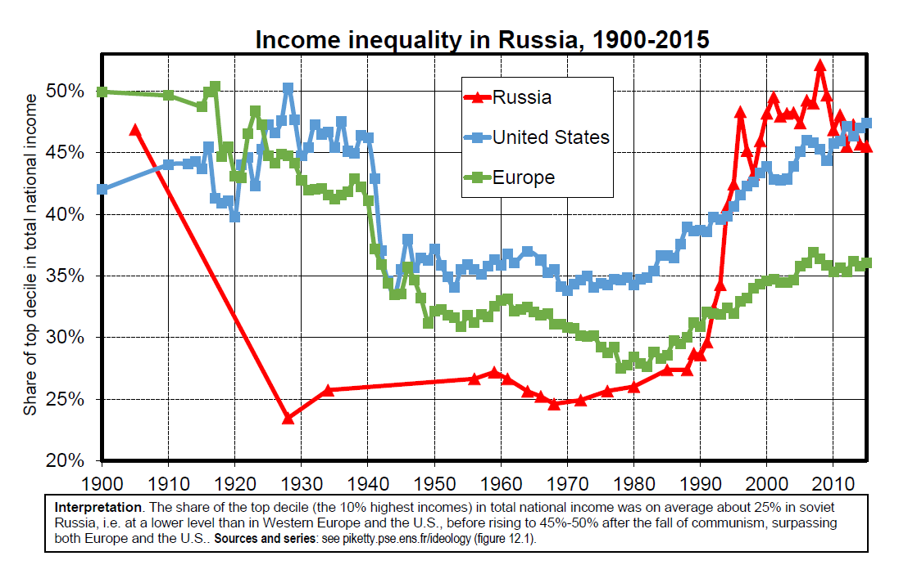
```

```{r echo=FALSE, , fig.align='center', out.width="85%"}
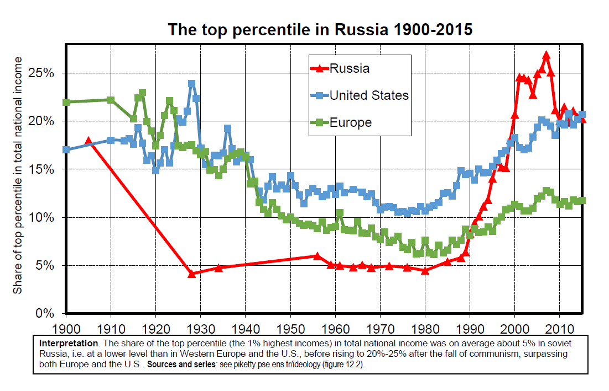
```

```{r echo=FALSE, , fig.align='center', out.width="85%"}
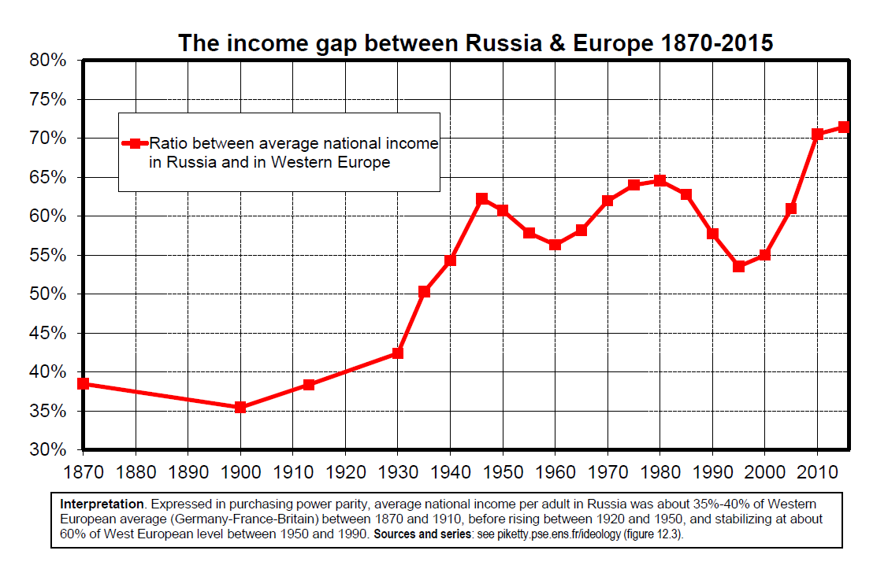
```

### Post-communist societies: the case of Russia

* **1990-1993: shock therapy, hyper-inflation, voucher privatization, loans- for-shares** >> transfer of ownership of large parts of Russia’s national wealth and natural ressources to a small group of « oligarchs »

* 1992-2018: 10% GDP of trade surplus per year on average (oil, gas), but
only 20%-30% of foreign reserves by 2018, while they should be at least
200%-300% of GDP (like in Norway)

* Official Balance of Payment: huge negative returns on Russian foreign
investment, huge positive returns on foreign investment in Russia

* But major anomalies: **missing wealth (capital flight) = at least 100% GDP**

* At least 50% of total financial assets held via tax havens: world’s highest levels together with Gulf countries (oil-based monarchies)

* **Russia 1990s-2010s: flat income tax at 13%**


```{r echo=FALSE, , fig.align='center', out.width="92%"}
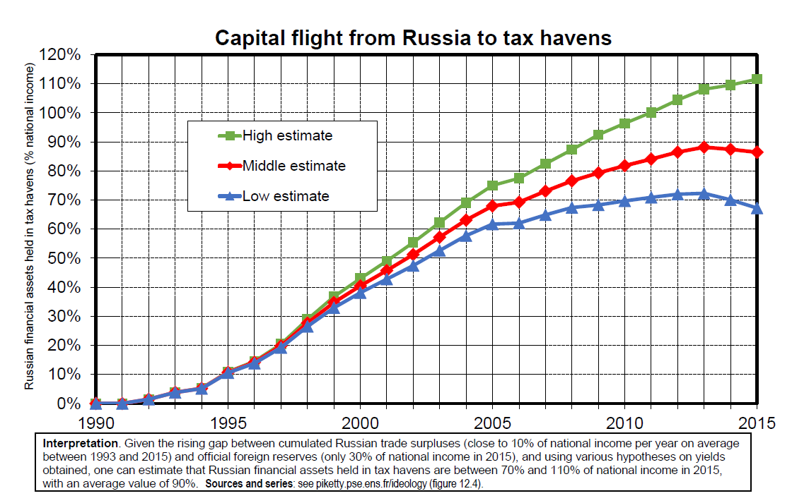
```

```{r echo=FALSE, , fig.align='center', out.width="92%"}
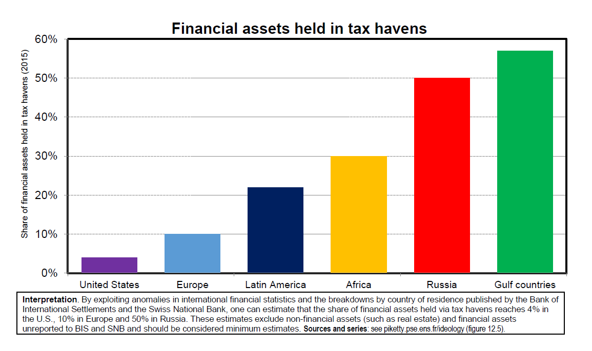
```

### From public to private property: the case of China

* The share of public property in national wealth seems to have stabilized at about 30% since 2007-2008: China has become a mixed-property economy (comparable to Western countries in 1950s-1970s)

* Inequality increased since 1980s, but still more equal than US (according to available sources)

* But huge opacity: almost no data from progressive income tax system;
complete absence of inheritance tax and registration system

* [Novokmet, Piketty, Yang, Zucman, From Communism to Capitalism: Private vs Public Property and Inequality in China and Russia] (http://piketty.pse.ens.fr/files/NPYZ2018.pdf)

* [AEA PP, 2018 (WID.world WP)](http://wid.world/wp-content/uploads/2018/01/NPYZ2018.pdf)\
[Capital Accumulation, Private Property and
Rising Inequality in China, 1978-2015](http://piketty.pse.ens.fr/files/PikettyYangZucman2019AER.pdf)\ AER 2019 [WID.world ](http://wid.world/document/t-piketty-l-yang-and-g-zucman-capital-accumulation-private-property-and-inequality-in-china-1978-2015-2016/)


```{r echo=FALSE, , fig.align='center', out.width="80%"}
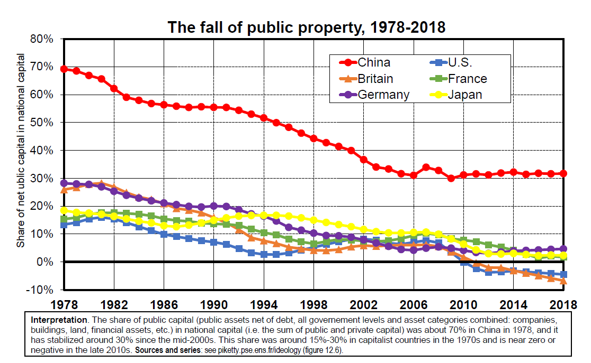
```

```{r echo=FALSE, , fig.align='center', out.width="80%"}
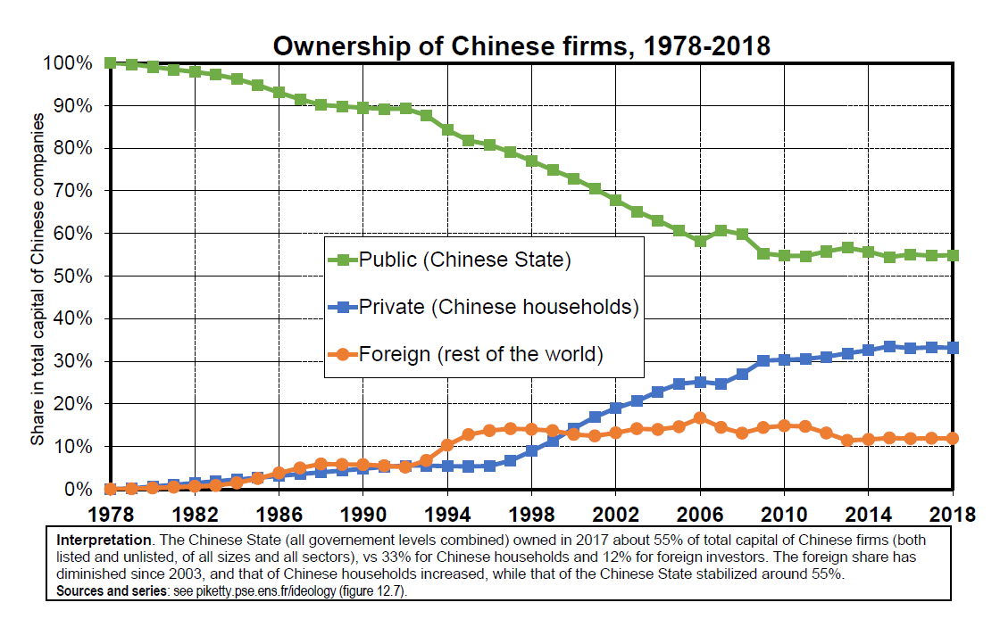
```

```{r echo=FALSE, , fig.align='center', out.width="78%"}
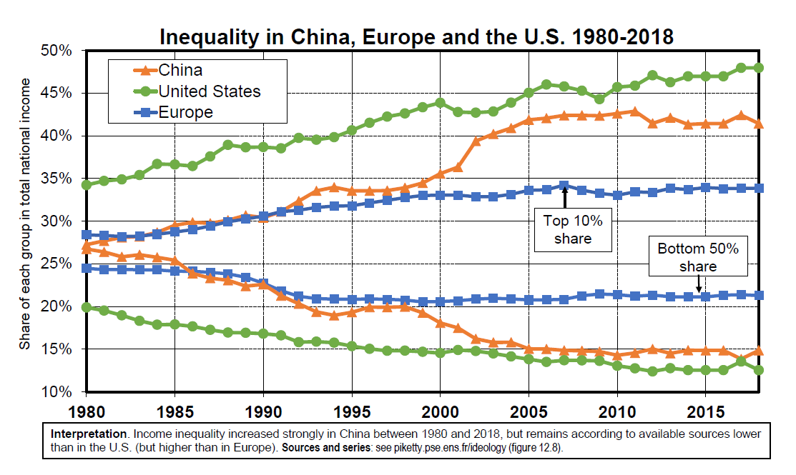
```

### Eastern Europe, foreign assets and the East-West divide in the EU

* **Post-communist transition in Eastern Europe: more gradual than in
Russia; the rise of inequality & oligarchs was less spectacular** (bigger share of foreign investment in industries)

* **Total inequality in West+East Europe is still much smaller than in the USA** (and a lot smaller than in USA+Mexico+Canada)

* But Europeans do not compare their inequality levels to USA, Mexico or
Brasil: they compare to previous decades in Europe

* **Eastern Europe 2010s: very large outflows of foreign profits** (stagnating wages >>> large profits for German or French investors), much larger than inflows of public EU transfers

* The view that market prices are always fair and that we should focus on public transfers is incomplete: market prices like wages and profits depend on bargaining power, legal system, etc. **A large federal community cannot rely on « market discipline » as the only coordinating device.**


```{r echo=FALSE, , fig.align='center', out.width="78%"}
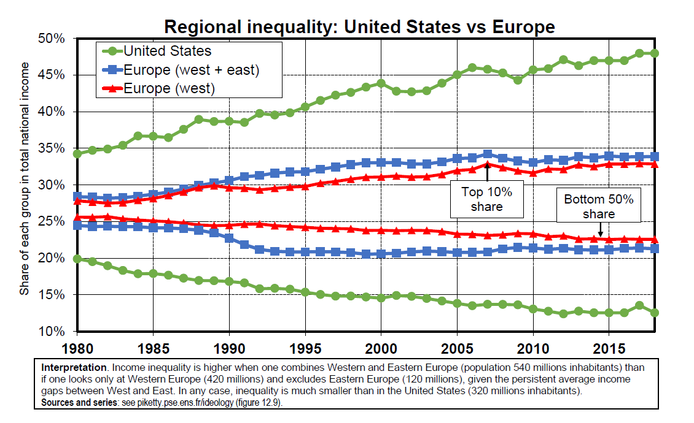
```

```{r echo=FALSE, , fig.align='center', out.width="80%"}
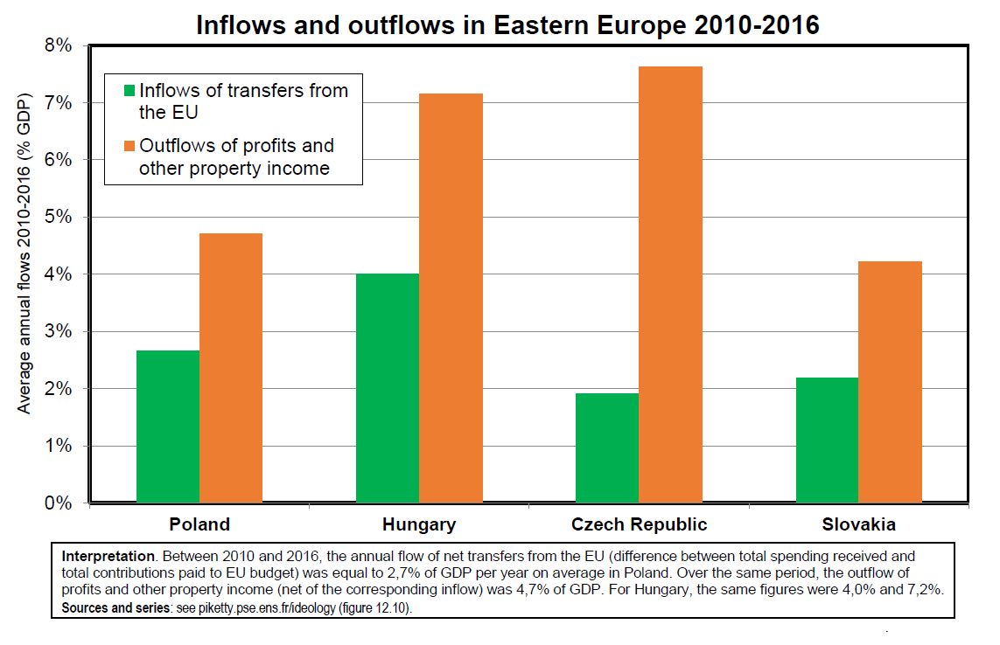
```

### Interest rates and the North-South divide in the Euro area

* **Same problem of market sacralization with public-debt interest rates**

* 2000-2009: same interest rate for all public debts in Euro area

* 2009-2019: speculative attacks on Southern Europe, following 2009
announcement that ECB will not support Greece if rating agencies
downgrade the country

* New budgetary treaties (TSCG, ESM) in 2012-2013, stabilization of Euro
area by ECB, but new recession and sluggish recovery

* The winners of the market equilibrium often tend to present market prices as being fair and balanced, but most markets need to be regulated, andsome need to be closed. **It is difficult to have a single currency without a common budget and public debt (i.e. a single interest rate).**


```{r echo=FALSE, , fig.align='center', out.width="80%"}
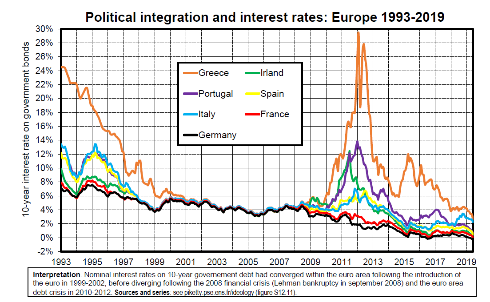
```

### Global inequality in the 21c: between modernity & archaism

* **Extreme inequality in the early 21c: legacies of ancient inequality regimes** (slavery, discrimination: South Africa, USA, Brasil, India, etc.) and **modern economic forces** (Middle East: highest inequality level in the world, based upon the transformation of oil ressources into global financial wealth funds via international legal system and capital
markets) (also: key role of colonial frontier system)

* [F. Alvaredo, L. Assouad, T. Piketty, Measuring Inequality in the Middle East, 1990-2016 the World's Most Unequal Region?](http://piketty.pse.ens.fr/files/AAP2019RIW.pdf)

* [RIW 2019(WID.world WP)](http://wid.world/document/alvaredoassouadpiketty-middleeast-widworldwp201715/)


```{r echo=FALSE, , fig.align='center', out.width="85%"}
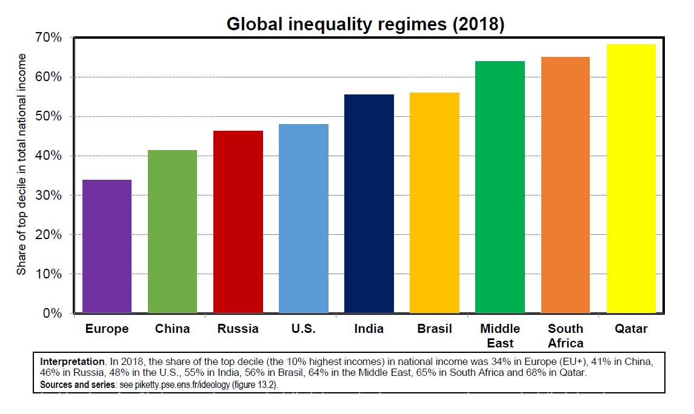
```

```{r echo=FALSE, , fig.align='center', out.width="85%"}
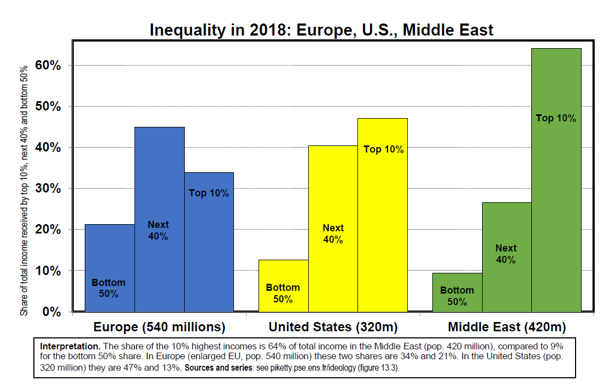
```

```{r echo=FALSE, , fig.align='center', out.width="74%"}
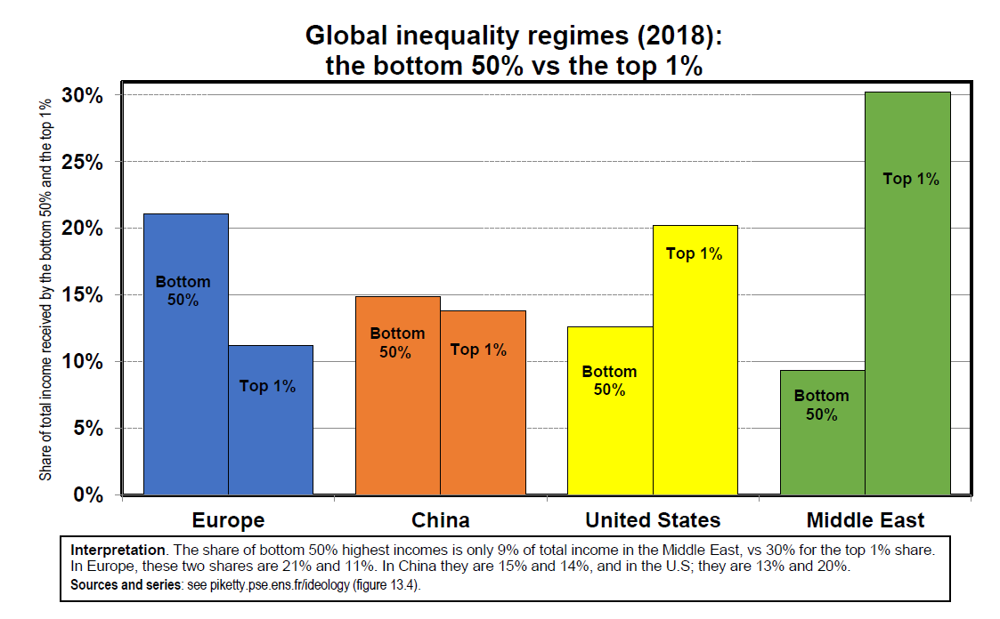
```

```{r echo=FALSE, , fig.align='center', out.width="74%"}
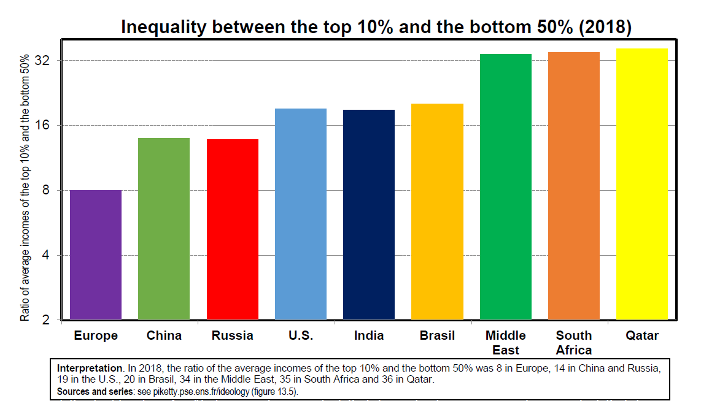
```

```{r echo=FALSE, , fig.align='center', out.width="74%"}
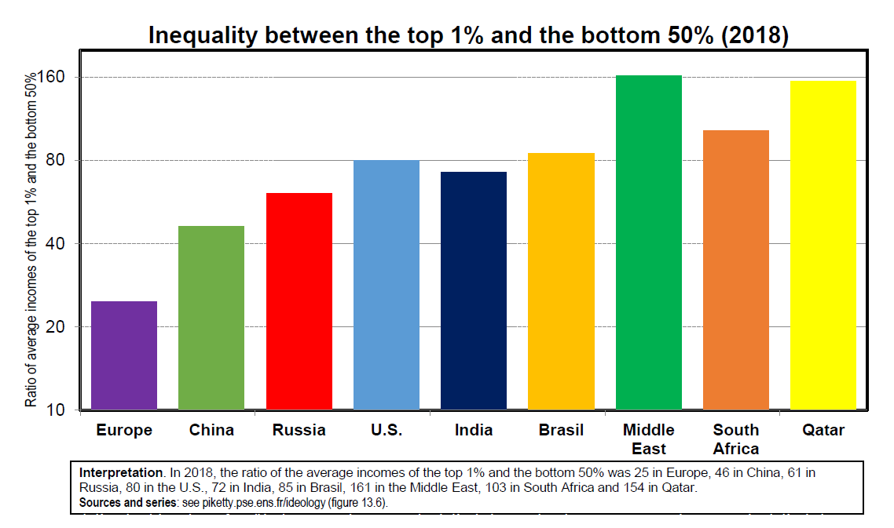
```

```{r echo=FALSE, , fig.align='center', out.width="85%"}
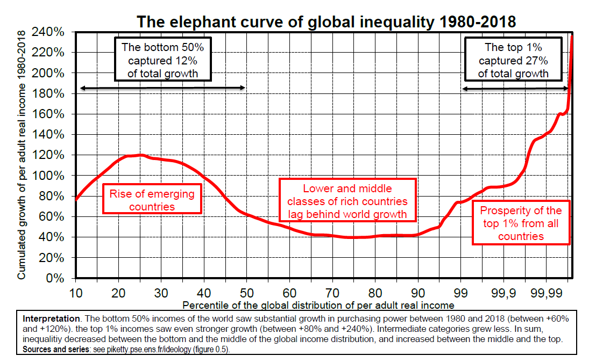
```

### Environmental inequality, financial opacity

* Two defining characteristics of the early 21c inequality regime:

* **Enormous environmental inequality**: top 10% carbon emitters are
responsible for close to half of world emissions, top 1% carbon emitters
emit more than the bottom 50% world emitters. In principle, corrective
taxation of externalities should imply large sanctions on the US.

* **Extreme financial opacity**: the lack of transparency on international ownership patterns makes it very difficult to track the evolution of global wealth concentration. Legacy of the free-capital-flows treaty adopted in the 1980s-1990s. See e.g. K. Pistor, The Code of Capital. How the Law Creates Wealth and Inequality, Princeton UP 2019


```{r echo=FALSE, , fig.align='center', out.width="85%"}
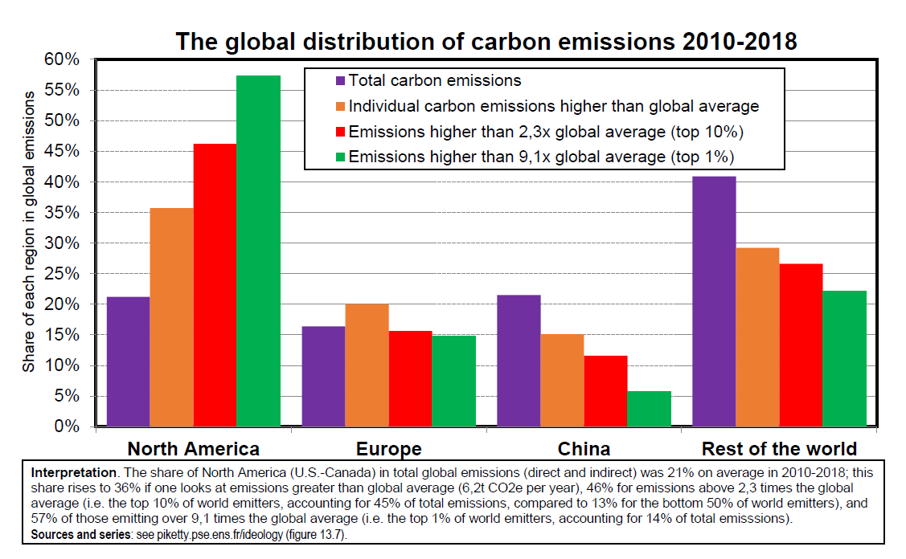
```

```{r echo=FALSE, , fig.align='center', out.width="85%"}
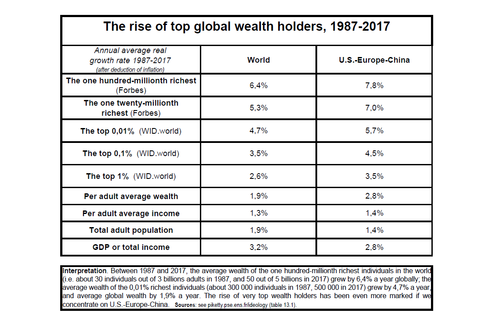
```

```{r echo=FALSE, , fig.align='center', out.width="85%"}
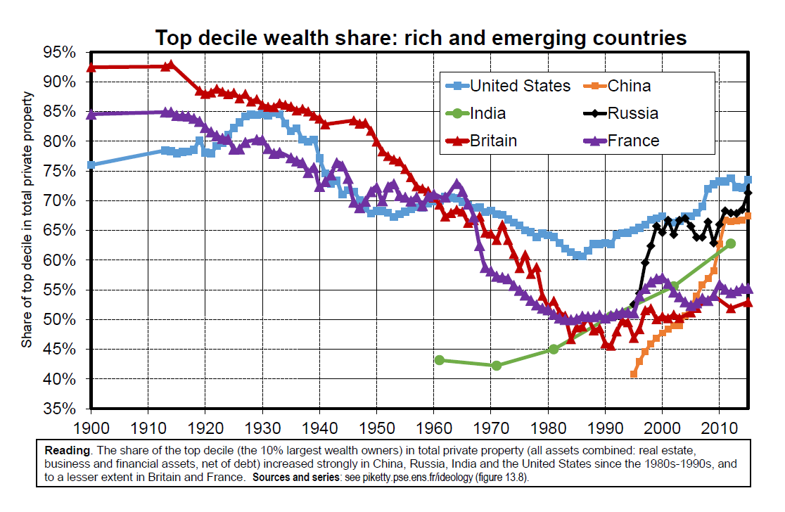
```

```{r echo=FALSE, , fig.align='center', out.width="85%"}
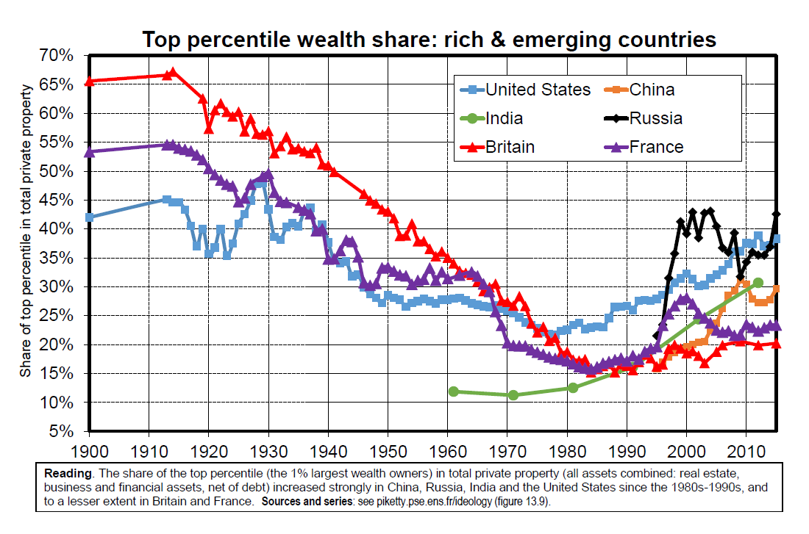
```

```{r echo=FALSE, , fig.align='center', out.width="85%"}
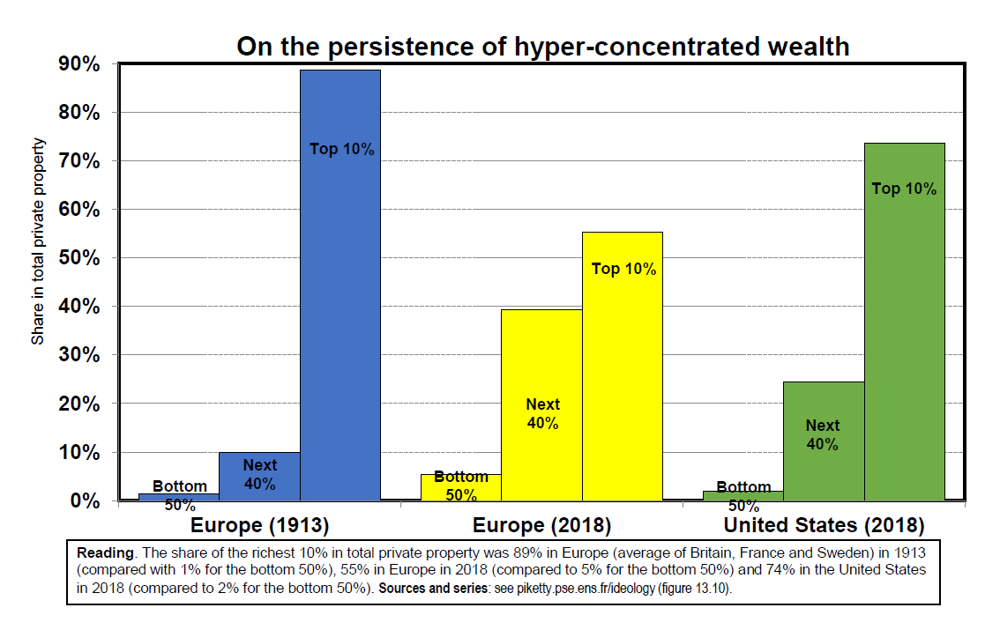
```

### The (very) slow decline of gender inequality

* Female suffrage: New Zealand 1893, Britain 1928, Turkey 1930,
Brasil 1932, France 1944, Switzerland 1971, Saudi Arabia 2015...

* Very slow access of women to high ranking occupations and high
paying jobs. Without quotas/reservations, this might never work.

* Female share in top 1% earnings in France: 10% 1995, 16% 2015,
50% in 2102?

* Same slow evolution in the US

```{r echo=FALSE, , fig.align='center', out.width="80%"}
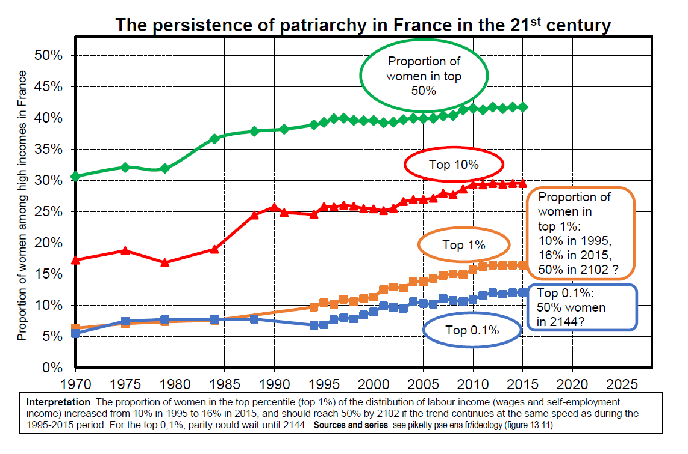
```

### Uneven state building in developing countries

* In 15c-20c Europe, the process of state building has been a central and complex component of the process of modernization and
socioeconomic development. It involves the construction of shared
norms of trust and justice across territories and social classes.

* In many world regions, e.g. Africa, Middle East, etc., the process of state building is still going on. And it is taking new routes in Europe (EU) and with the rise of transnational governance.

* In low-income countries, state capacity declined during the 1980s-1990s due to accelerated trade liberalization (>> loss in trade tax revenues) without sufficient investment in alternative fiscal capacity

* See Cage-Gadenne, « Tax revenues and the fiscal cost of trade
liberalization (1792-2006) », [EEH2018](https://sites.google.com/site/juliacagehomepage/my-files/cage_gadenne_EEH_2018.pdf)


```{r echo=FALSE, , fig.align='center', out.width="80%"}
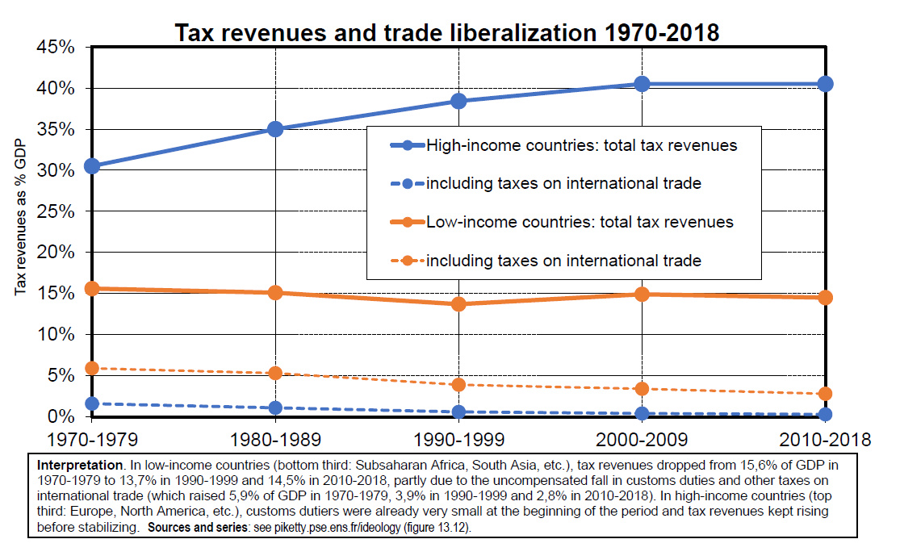
```


### The return of central banks and money creation: a long-run view

* **Post-2008 money creation: back to central bank balance sheet size observed after WW1-2**

* Central banks are the only public institutions which can create ressources instantaneously and intervene 

* **Large post-2008 intervention: legacy of 1929 trauma**\
(post-Friedman consensus: both the right and the left concluded from the experience of 1930s that central banks should play a role of banker of last resort) ($\neq$ orthodox liquidationist view) (see M. Friedman, A Monetary History of the US 1867-1960, PUP 1963)

* **But the large post-2008 intervention also reflects a lack of consensus about other public policies**: progressive taxation, Green New Deal, transnational democracy in Europe & elsewhere, etc. >> **too much is asked to central banks**


```{r echo=FALSE, , fig.align='center', out.width="80%"}
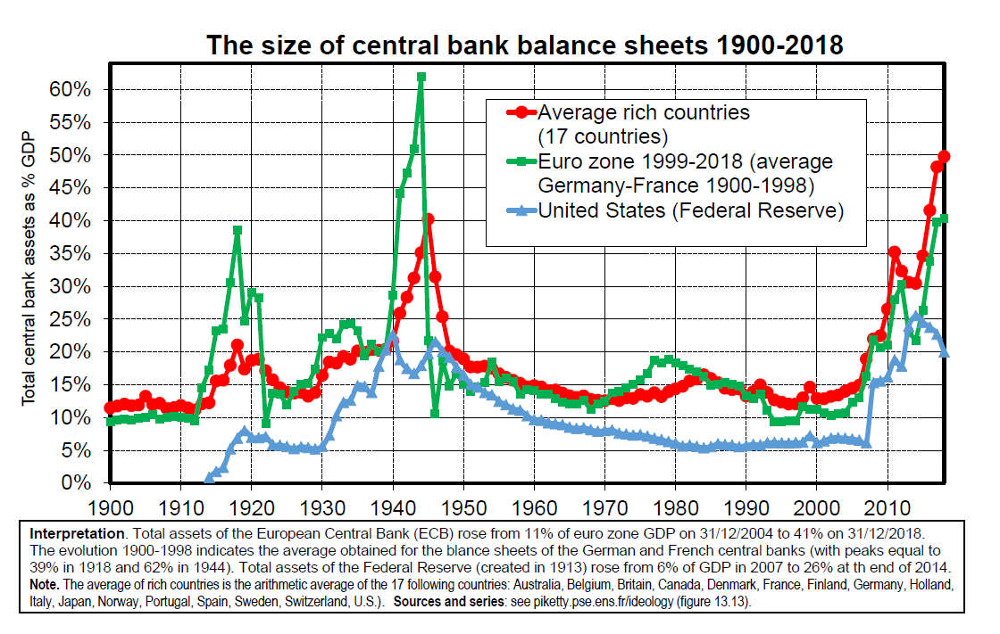
```

```{r echo=FALSE, , fig.align='center', out.width="80%"}
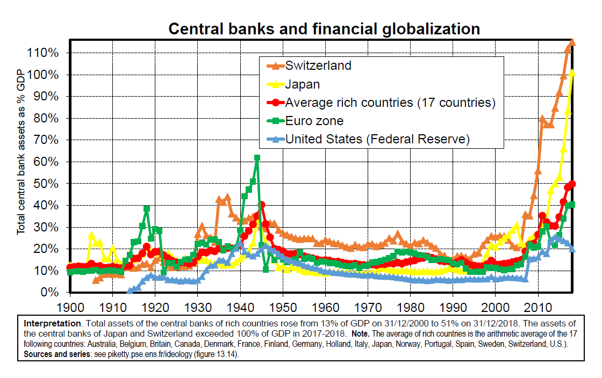
```


