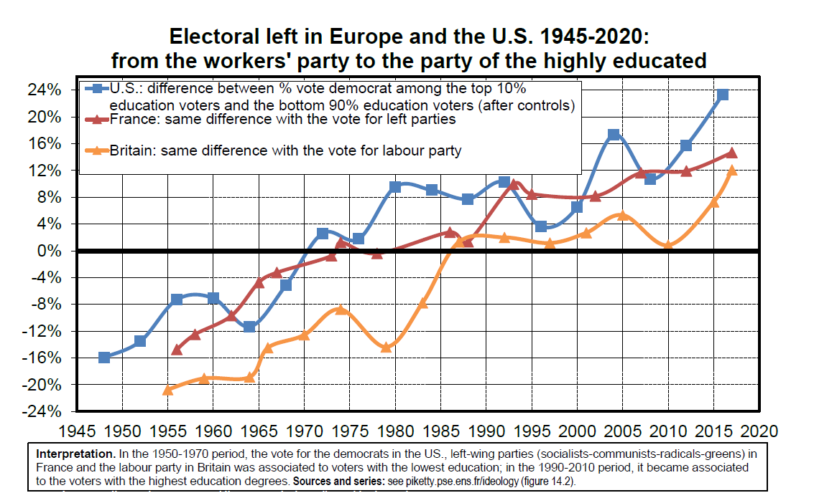
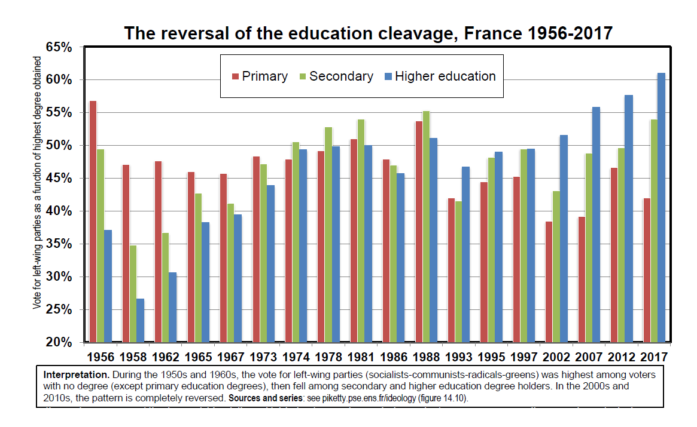

# Social inequality and party systems in historical perspective: Europe versus US

### Beyond left and right: the dimensions of political conflict

* Main lesson from lectures 1-6: **political and ideological changes play a
crucial role in the process of socio-economic development & the evolution
of inequality structures**. Successful economic development requires a
minimal consensus about the level & structure of social inequality.

* **Therefore it is critical to better understand changing political attitudes and beliefs systems about inequality, the fair economy & the just society**

* It is relatively easier to study beliefs systems in electoral democracies, in the sense that these beliefs systems translate into recorded voting attitudes

* **Key question: what forms do the various political parties & coalitions take in different societies and historical periods, and how do they relate to inequality and redistribution?** What are the different dimensions of political conflict and how do they change over time?\
**Was there something unique in 1950-1980 left-right party system & why?  **

* On-going comparative research program using post-electoral surveys:

* [T. Piketty, Brahmin Left vs Merchant Right: Rising Inequality and the Changing Structure of Political Conflict. Evidence from France, Britain & the US 1948-2017](http://piketty.pse.ens.fr/files/Piketty2018.pdf)

* [A. Gethin, C. Martinez-Tolenado, T. Piketty, Political Cleavages & Inequality. Evidence from Electoral Democracies 1950-2018](http://piketty.pse.ens.fr/files/GethinMartinezPiketty2019Slides.pdf), WID.world, 2019

* [A. Banerjee, A. Gethin, T. Piketty, Growing Cleavages in India? Evidence from the Changing Structure of Electorates 1962-2014, Economic and Political Weekly, 2019](http://piketty.pse.ens.fr/files/BanerjeeGethinPiketty2019EPW.pdf) (WID.world WP)

* More countries are currently being studied

* **Unfortunately, there exists no post-electoral survey before the 1940s-1950s. In order to study longer time periods, one needs to use other data sources: local-level election results matched with local-level census & fiscal data.**
 
 
* **« Standard » view of the left-right party system:**
  + political conflit is about redistribution between social classes
  + lower socioeconomic groups vote for the left, higher groups vote for the right

* **Pb: this « standard » view may apply to certain societies and historical
periods (e.g. 1950-1980 in Western electoral democracies), but it is certainly not universal.**

* **First, the different dimensions of socioeconomic cleavages (education,
income, wealth, etc.) may not always be aligned.** E.g. they were aligned in
1950-1980, but in 1990-2020 we observe the rise of a « multiple elites »
system: educational elite now votes for the left, while wealth elite keeps
voting for the right (though less and less so) (Brahmin Left vs Merchant Right)

* **Next, other dimensions of social cleavages, in particular in relation to ethnic or religious identity and foreign origins, can play a central role**, in a way that can vary a lot across societies and over time.
 
```{r echo=FALSE, , fig.align='center', out.width="85%"}
knitr::include_graphics("Plots/plot_7-1.png")
```

### The electoral left: from workers’ party to the party of the educated

* **Key transformation over the 1950-2020 period: a complete reversal of the education cleavage.**

* I.e. in 1950-1970 period, the less educated voters vote more for the « left » than the more educated. In the 1990-2020 period, it is the opposite.

* Very gradual change happening in all Western electoral democracies over
the 1980-2020 period (in particular US, UK, France), in spite of the many
historical differences in party systems

* **At the same time, one observes in recent decades a fall in electoral participation among lower socioeconomic groups**


```{r echo=FALSE, , fig.align='center', out.width="85%"}

```

```{r echo=FALSE, , fig.align='center', out.width="85%"}

```


```{r echo=FALSE, , fig.align='center', out.width="85%"}

```

* **Why did lower socioeconomic groups stop voting for the « left »?**

* US-centered explanation: « poor white flight » away from the Democrats
following the Civil Rights movement. I.e. the poor racists abandonned the left.

* Problem with this explanation: the same gradual evolution happened in Europe, even though there was no Civil Rights movement in the 1960s

* Potentially more convincing: **« left » parties gradually changed their policy platform & abandonned lower socioeconomic groups.** Or, to put it in a more positive way, they were unable to adjust their platform to economic changes.
\
* **Large and persistent inequalities in access to education**. With the rise of higher education, left parties became the party of the highly educated. Possible explanation: it was easier to design an egalitarian education platform at the time of primary & secondary education than with higher education.

* **Decline in tax progressivity and redistribution since 1980s-1990s:** tax
competition, lack of international coordination and financial transparency.

* **Rise of post-colonial identity-based conflict & xenophobic right in Europe & US since 1980s-1990s** reinforced the evolution but was not the primary factor.

### The reversal of the education cleavage: the case of France

* **Very robust finding**

* True both for presidential and legislative elections

* True all along the primary-secondary-higher education hierarchy

* True before and after controls for other variables: age, gender,
income, wealth, etc.


```{r echo=FALSE, , fig.align='center', out.width="100%"}

```

```{r echo=FALSE, , fig.align='center', out.width="100%"}
knitr::include_graphics("Plots/plot_7-6.png")
```

```{r echo=FALSE, , fig.align='center', out.width="100%"}

```

```{r echo=FALSE, , fig.align='center', out.width="100%"}

```

```{r echo=FALSE, , fig.align='center', out.width="100%"}

```

```{r echo=FALSE, , fig.align='center', out.width="85%"}

```

```{r echo=FALSE, , fig.align='center', out.width="85%"}

```

### Political conflict: education, income, property and identity

* **Unlike high education groups (which have turned to the left), high wealth groups have kept voting for the right (though less and less so)**.
High income groups are between the two: human capital and financial
capital have opposite effects and are not fully correlated.

* **New cleavages based upon ethnic-religious identity and foreign origins have started to play a more important role since the 1980s-1990s**


```{r echo=FALSE, , fig.align='center', out.width="100%"}

```

```{r echo=FALSE, , fig.align='center', out.width="100%"}

```

```{r echo=FALSE, , fig.align='center', out.width="100%"}
knitr::include_graphics("Plots/plot_7-14.png")
```

```{r echo=FALSE, , fig.align='center', out.width="100%"}

```

```{r echo=FALSE, , fig.align='center', out.width="100%"}

```

```{r echo=FALSE, , fig.align='center', out.width="100%"}

```

```{r echo=FALSE, , fig.align='center', out.width="85%"}

```

```{r echo=FALSE, , fig.align='center', out.width="85%"}

```


### Borders and property: the four-way electorate in France

* The current political conflict in France can be summarized with two main
dimensions: **support or hostility to redistribution** between rich and poor, and **support or hostility to migrants.**

* I.e. conflict about wealth vs conflict about borders.

* The striking point is that these two dimensions have little correlation in the distribution of voters preferences, so that in effect the electorate is divided between four quarters of comparable size.

* $\rightarrow$ **very unstable situation** (as exemplified by first round of presidential election 2017: very tight race between four candidates)

* **Future evolution will depend on which of the two dimensions will appear
to matter the most**: if redistribution is considered to be impossible (e.g. due to tax competition), then the conflict will be mostly about borders


```{r echo=FALSE, , fig.align='center', out.width="85%"}
knitr::include_graphics("Plots/plot_7-20.png")
```

```{r echo=FALSE, , fig.align='center', out.width="85%"}

```

### Changing political cleavages in the United States

* **Unlike France, US formally has a two-party system**: Democrats vs
Republicans (partly due to electoral system)

* **But in practice each party is also divided by major conflicts about redistribution** (some Dems are strongly pro-redistribution, some not)
& **migration/ethnicity** (some Reps are strongly anti-minority, some not)

* In the end, the general evolution of the structure of political conflict in recent decades bears a lot of similarity with that of France, including
the unstablity of the four-way electorate


```{r echo=FALSE, , fig.align='center', out.width="85%"}

```

```{r echo=FALSE, , fig.align='center', out.width="85%"}

```

```{r echo=FALSE, , fig.align='center', out.width="85%"}

```

```{r echo=FALSE, , fig.align='center', out.width="85%"}

```

```{r echo=FALSE, , fig.align='center', out.width="85%"}
knitr::include_graphics("Plots/plot_7-26.png")
```

```{r echo=FALSE, , fig.align='center', out.width="85%"}

```

```{r echo=FALSE, , fig.align='center', out.width="85%"}

```

```{r echo=FALSE, , fig.align='center', out.width="85%"}

```

```{r echo=FALSE, , fig.align='center', out.width="85%"}

```

### Changing political cleavages in the United Kingdom

* **Despite the UK, US and French party systems, it is striking to see relatively similar evolutions in all three countries**

* **This expresses the fact that Western electoral democracies have gone through comparable challenges and limitations:**
large & persistent educational inequalities (higher education challenge);
tax competition & globalization; post-communist hyper-capitalism;
post-colonial

* But there are also UK specifities: shifts in Labour party leadership;
rising role of the conflict over Brexit


```{r echo=FALSE, , fig.align='center', out.width="85%"}

```

```{r echo=FALSE, , fig.align='center', out.width="85%"}

```


```{r echo=FALSE, , fig.align='center', out.width="85%"}

```

```{r echo=FALSE, , fig.align='center', out.width="85%"}

```

```{r echo=FALSE, , fig.align='center', out.width="85%"}

```

```{r echo=FALSE, , fig.align='center', out.width="85%"}

```

```{r echo=FALSE, , fig.align='center', out.width="85%"}
knitr::include_graphics("Plots/plot_7-37.png")
```

```{r echo=FALSE, , fig.align='center', out.width="85%"}

```

```{r echo=FALSE, , fig.align='center', out.width="85%"}

```

### The cleavage about Europe and globalization

* In the UK, but also in France and in most European countries, the conflict about European integration has played a more & more important role in recent decades

* **Referendum about Europe in UK 2016 and in France 1992 & 2005:
in all cases, only top socioeconomic deciles support European Union**

* **Conflict about EU cuts across « standard » left-right lines because it is a transnational conflict that is both about redistribution between rich and poor** (EU and the free mobility of capital and goods and services are perceived to favour the most mobile and wealthiest economic actors) **and about borders**, **identity and migration** (EU membership implies free labor mobility)

* Without some fundamental changes to EU functionning and some form of
« **social-federalism** » (common social policies to reduce inequalities: tax justice,
education, wages, environment, etc.), it is difficult to see why this will change

```{r echo=FALSE, , fig.align='center', out.width="85%"}

```

```{r echo=FALSE, , fig.align='center', out.width="85%"}

```