  
# Political cleavages in post-colonial societies: social-nativism vs social-federalism

### The reversal of education cleavage in Western democracies

* **The reversal of the education cleavage happened not only in France, the US and in the UK, but also in all other developed countries**: Germany, Sweden, Norway, Italy, Australia, Canada, New Zealand, Netherlands, etc.

* Main explanations:

  + **Large and persistent educational inequalities**

  + **Widespread perception that lower socioeconomic groups were gradually abandonned by ruling parties** (captured by the winners of globalization)

  + **Post-communist disillusionment** against any form of internationalist socialism

  + **Post-colonial identity** conflict exploited by xenophobic right\
$\rightarrow$ **rise of « social-nativism **» : « the only way to protect socially disadvantaged natives is to protect borders and to fight migration, & certainly not to make false promises about universal solidarity, internationalism and socialism »
  
```{r echo=FALSE, , fig.align='center', out.width="85%"}
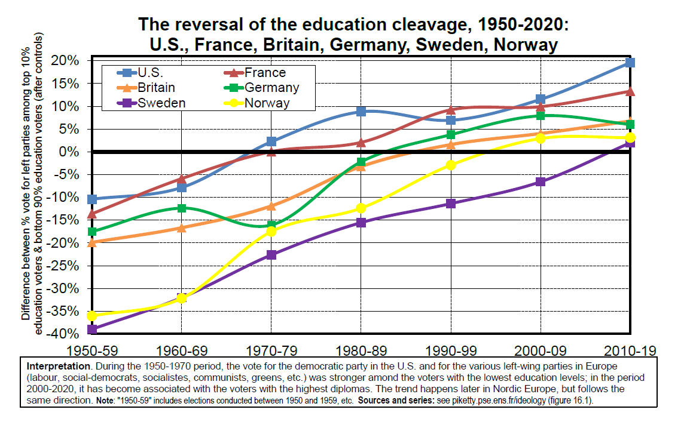
```

```{r echo=FALSE, , fig.align='center', out.width="80%"}
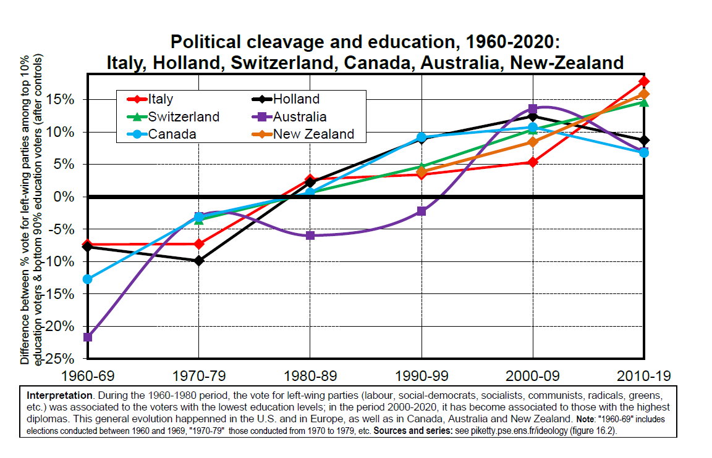
```

### The rise of social-nativism in post-communist Eastern Europe

* For obvious reasons, post-communist disillusionment is particularly strong in Eastern Europe

* In many cases, former communist parties (turned social-democrats) took
command of privatization during 1990s before falling into corruption scandals and/or voter disappointment during 2000s

* Typical example: **Poland**. Social-democrats (SLD) have almost entirely
disappeared, so that **the political conflict is now between PO (Civic Platform) (liberals-conservatives, pro-business, pro-EU) and PiS (Law and Justice) (nationalists-conservatives, anti-migrants, anti-EU) (=social-nativists)**

* The PiS has been very good at portraying itself as pro-poor (creation of family benefits in addition to strong anti-migrant and nationalist stance), and has been to win two consecutive elections in 2015-2019


```{r echo=FALSE, , fig.align='center', out.width="80%"}
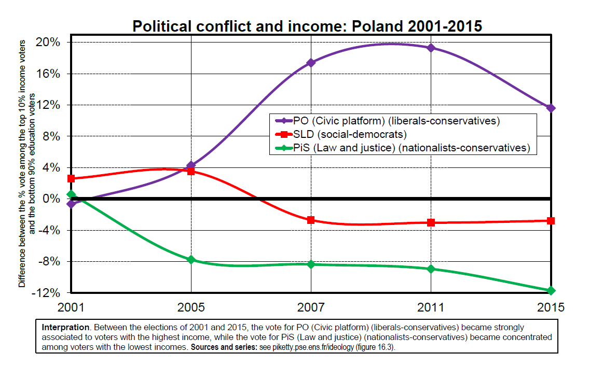
```

```{r echo=FALSE, , fig.align='center', out.width="85%"}
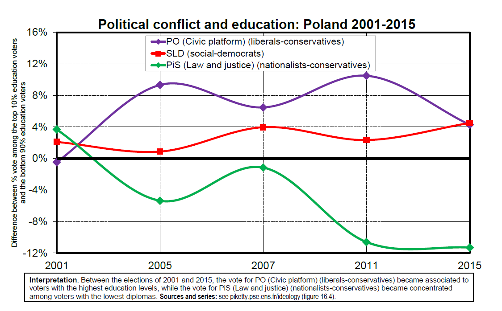
```


### The social-nativist trap: lessons from Europe and the US

* **Can the social-nativist parties in Europe become social-democratic parties in the long run, like the Democratic party in the US in the 20c?**

* **First, it is important to remember that this transition took a very long time in the US, and that it involved enormous human damages.**

* I.e. between the 1870s and the 1950s, Southern Democrats enforced very
strict racial segregation, encouraged KKK & the lynching of blacks, etc.

* Do we want Poland’s PiS, French National Front or Italian Liga to conduct
violent policies against migrants & their descendants for many decades
before finally turning to Civil Rights policies, like US Democrats in the 1960s?

* **Next, given the level of postcommunist desillusionment in early 21c, and also the magnitude of international tax competition to attract investment** (which requires extensive international cooperation to be defeated), **it is very unlikely that 21c social-nativist parties would turn to become New Deal parties** with large tax progressivity and anti-inequality policies

* PiS in Poland: redistribution via lump-sum family benefits, but nothing on
progressive taxation or workers rights

* Lega in Italy: anti-elitist discourse to justify strong stance against migrants, but very elitist (or nihilist) economic policy: repeal of progressive income tax

* FN/RN in France: used to adocate the repeal of the income tax (1980s); if
they were in power they would probably exacerbate tax dumping

* Trump in the US: **very strong stance againts migrants, Latinos, etc., but continuation of the Reagan tax cut agenda**


* **Catalonia and the separatist trap**
\newpage
* Given he high level of tax competition of Europe, it is tempting for every country or region to benefit from trade integration while at the same time benefiting from being a tax haven and attracting other country’s tax bases.\
**I.e. in the absence of federal taxes, there is clear incentive for high-income regions to become independant countries within Europe.**

* Typical exemple: Catalonia. **The higher the level of income, the stronger the support for regional autonomy or independance.**

* Of course the fiscal motive is not the only reason behind the independantist movement: there are also cultural and linguistic motives, and there are left republican groups promoting independance.

* But it is clear that the debate would look very different if high-income
taxpayers from Catalonia would keep paying the same income taxes to EU
whether or not they obtain independance (e.g. like California).

```{r echo=FALSE, , fig.align='center', out.width="75%"}
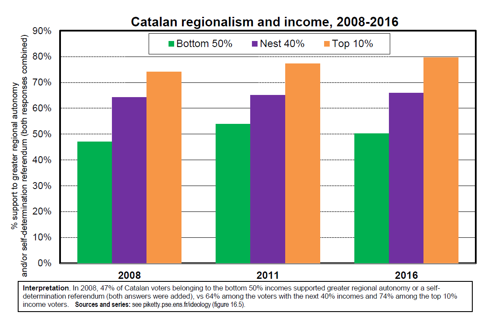
```

```{r echo=FALSE, , fig.align='center', out.width="75%"}
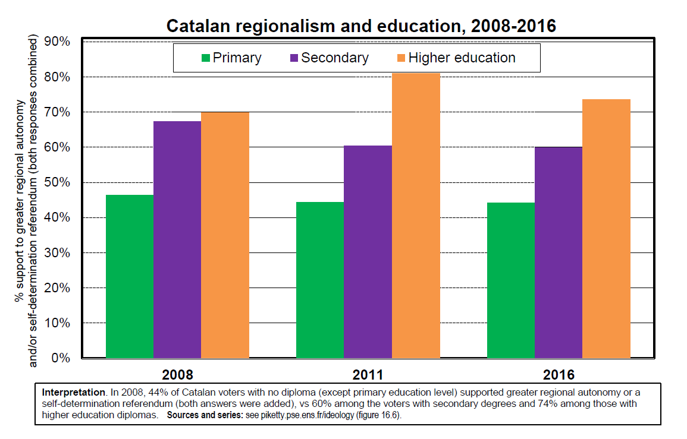
```

### Changing political cleavages and class conflict in India & Brasil

* **It is critical to look at the political economy of redistribution in electoral democraties outside the West**

* First, the breakdown of the left-right class-based party system observed in the West between 1950-1980 and 1990-2020 may not hold in other parts of
the world. E.g. **in India or Brasil, one observes a move toward a more class- based party system since the 1980s-1990s** (to some extent, and despite adverse international trends making redistributive policies hard to conduct).\
I.e. different political strategies and coalitions can make difference.

* Next, the structure of class-based vs identity-based conflict can take various forms and ought to be analyzed in a comparative spirit.
E.g. **anti-Muslim cleavages play a key role in India and are in a way closer to the European identity-based conflicts than to the US racial divide.**

* India’s party system. INC (Congress) was the independance party and used to be the dominant catch-all party.

* Beginning in the 1980s-1990s, the BJP (nationalist Hindu party) built its
strategy against the Muslim minority and against the extension of the quota
system from SC-ST (Scheduled Castes, Schedules Tribes) to OBC (other
backward classes, including Muslims)

* **As a consequence, BJP has developped as an upper-caste, upper-class party, while Congress and left parties (socialist or low-caste parties like BSP) attract both the votes of the poor Muslims & the poor Hindus $\neq$ Western democracies, where poor minority & poor majority voters generally do not vote for the same parties**

* This illustrates the role of institutions & ideology to build coalitions

* [See Banerjee-Gethin-Piketty, Growing Cleavages in India? Evidence from the Changing Structure of Electorates 1962-2014, Economic and Political Weekly, 2019](http://piketty.pse.ens.fr/files/BanerjeeGethinPiketty2019EPW.pdf) 

```{r echo=FALSE, , fig.align='center', out.width="85%"}
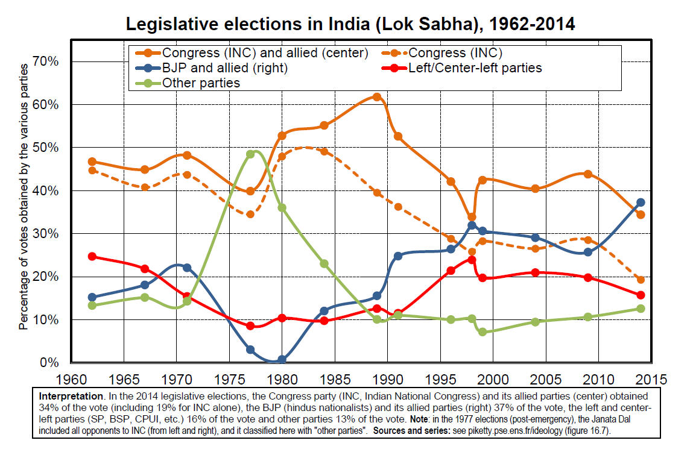
```

```{r echo=FALSE, , fig.align='center', out.width="85%"}
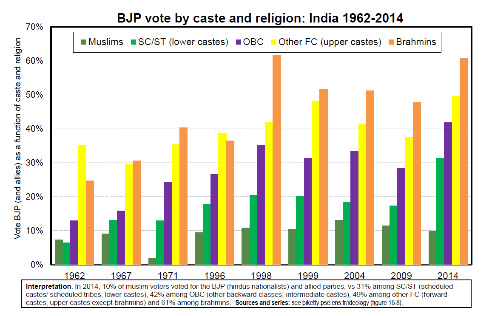
```

```{r echo=FALSE, , fig.align='center', out.width="85%"}
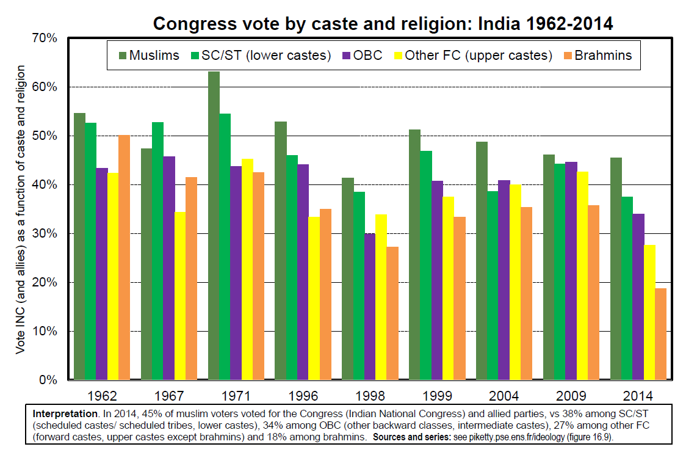
```

```{r echo=FALSE, , fig.align='center', out.width="70%"}
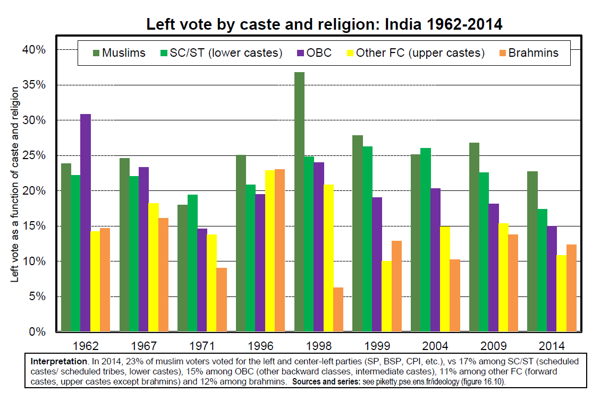
```

```{r echo=FALSE, , fig.align='center', out.width="72%"}
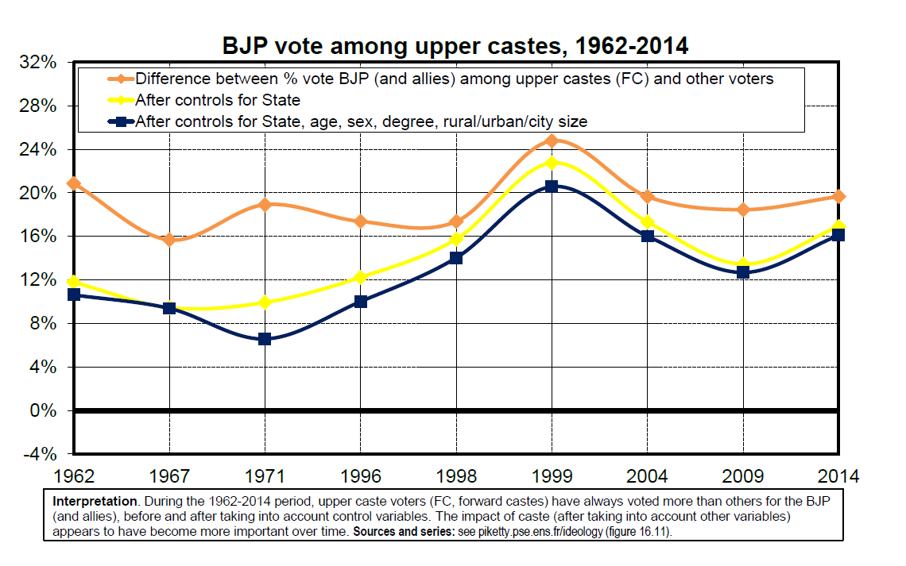
```

```{r echo=FALSE, , fig.align='center', out.width="70%"}
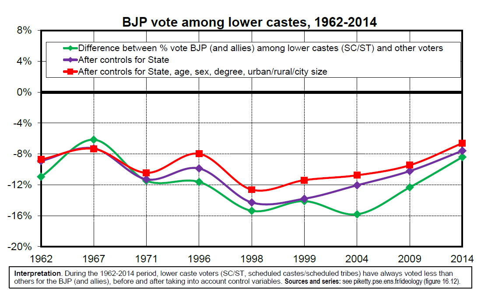
```

```{r echo=FALSE, , fig.align='center', out.width="85%"}
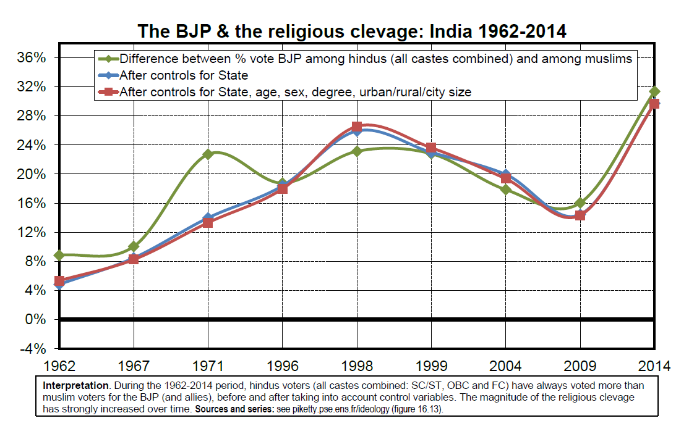
```

```{r echo=FALSE, , fig.align='center', out.width="85%"}
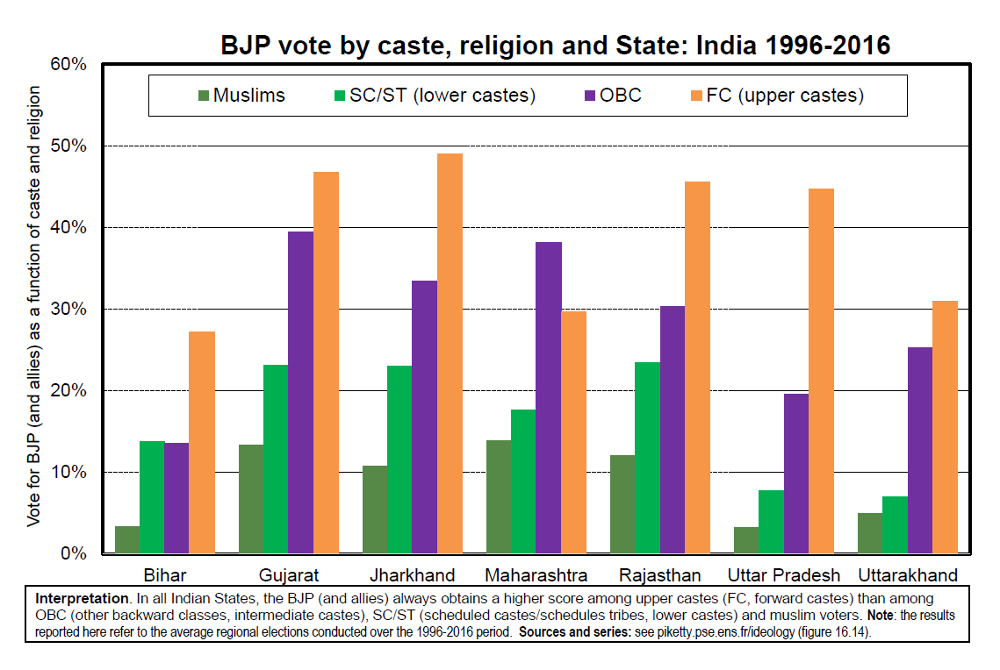
```

* **The case of Brasil is very different, but also illustrates a case of gradual policy-based development of a class-based conflict**

* The first elections with universal suffrage took place in 1989 in Brasil
(1890-1964: suffrage restricted to literate population; 1964-1985: military dictatorship)

* Many political parties, including PT (Workers Party), which intially attracted urban wage earners from manufacturing sector & intellectuals

* During PT’s experience in power in 2002-2014 that the PT electorate
started to concentrate upon lower-income and lower-education voters
(redistributive policies: Bolsa Familia, min wage, etc.)

* **Like India, Brasil’s experience also shows that it is difficult to develop a redistributive policy agenda in the current global ideological context, that is more favourable to identity-based conflict and nationalists**


```{r echo=FALSE, , fig.align='center', out.width="85%"}
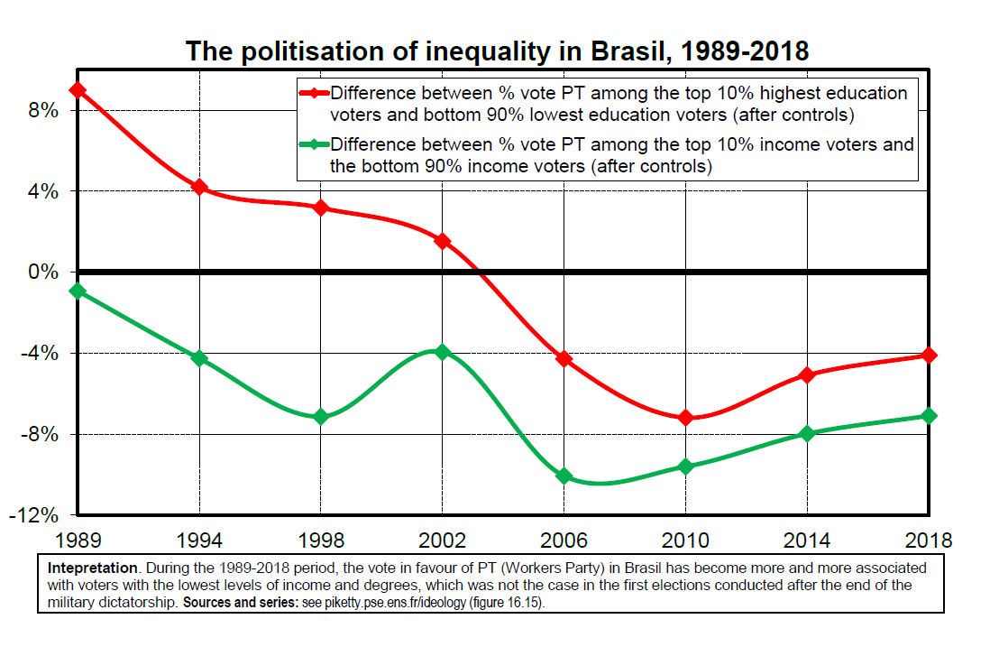
```
### Social-federalism vs social-nativism

* **The current organization of globalization**, in Europe and more generally at the world level, **is based upon free capital flows, free trade and laissez-faire competition between countries and economic actors**, with little no international cooperation on fiscal, social or environmental policies

* Pb: **economic openness has contributed to reduce poverty in poor countries, but free-market globalization also generates rising inequalities and social unrest, which itself fuels social-nativist & nationalist reactions**

* **Ideal solution = social-federalism, i.e. a new organization of globalization where trade and capital flows are subject to verifiable targets in terms of global public goods and global fiscal, social and environmental justice**


$\rightarrow$ major challenges for the future, together with the development of new forms of educational justice and redistribution of income and wealth


```{r echo=FALSE, , fig.align='center', out.width="82%"}
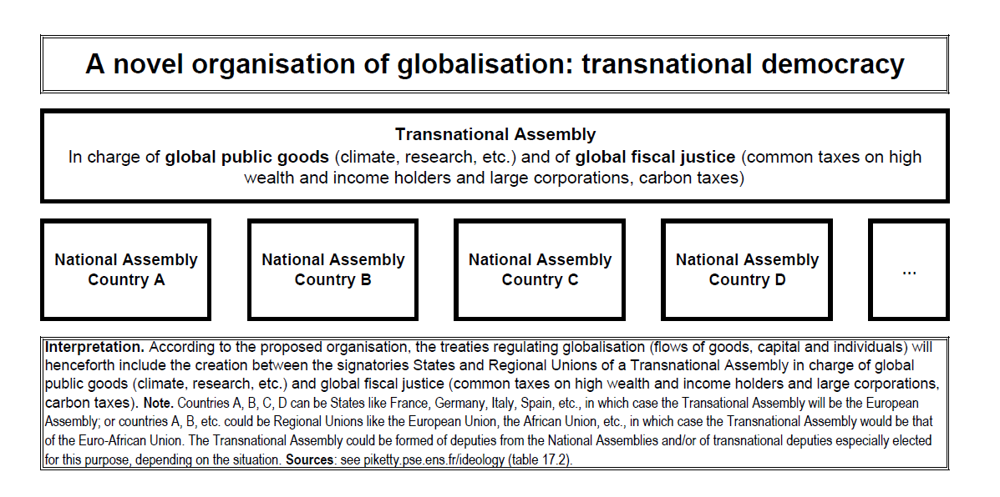
```

```{r echo=FALSE, , fig.align='center', out.width="80%"}
knitr::include_graphics("plot_8-17.png")
```

```{r echo=FALSE, , fig.align='center', out.width="82%"}
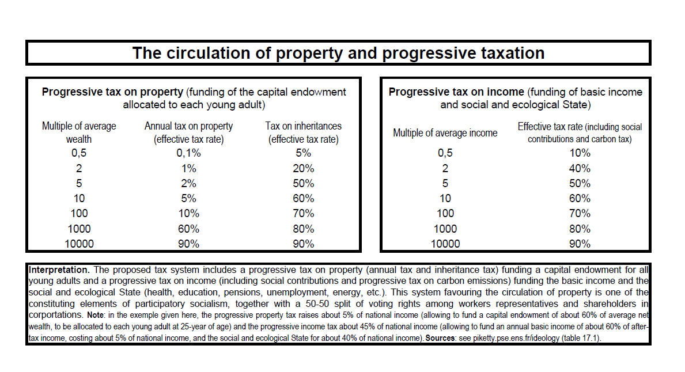
```


